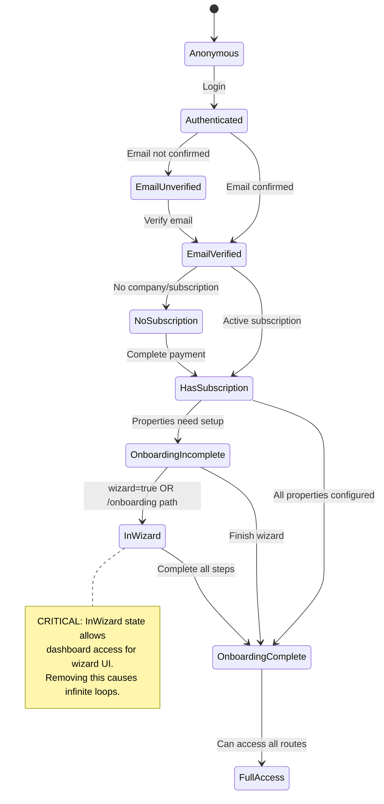

# Middleware Architecture - Bulletproof Redesign

**Document Version**: 1.0
**Created**: 2025-10-30
**Status**: PROPOSED
**Incident Reference**: [ONBOARDING_CRISIS_HANDOFF.md](../reference/ONBOARDING_CRISIS_HANDOFF.md)

---

## Executive Summary

This document proposes a complete redesign of the authentication and authorization middleware to prevent the critical production incident that occurred on 2025-10-30. The current middleware is fragile, with implicit business logic that was accidentally removed during refactoring, causing complete conversion pipeline failure.

**Key Problems Addressed**:
1. Wizard access logic was implicit and easily removed during refactoring
2. No clear state machine for route access decisions
3. Concerns not properly separated (auth vs authorization vs onboarding)
4. No fail-safes or circuit breakers
5. Difficult to test and reason about

**Solution Approach**:
- Explicit state machine with named states and transitions
- Separation of concerns via middleware chain
- Type-safe route configuration
- Circuit breakers and fail-safes
- Comprehensive logging and observability
- Impossible to accidentally break critical paths

---

## Root Cause Analysis

### What Went Wrong

**The Incident**: Commit `d078412` refactored middleware to use the `companies` table for subscription checks (architecturally correct) but accidentally removed the wizard access exception, causing an infinite redirect loop.

**Before Refactor** (WORKED):
```typescript
// Middleware implicitly allowed /dashboard/sites when wizard=true
// This logic was buried in conditionals
```

**After Refactor** (BROKE):
```typescript
// Middleware ALWAYS redirected incomplete onboarding to /onboarding
// No exception for wizard=true → infinite loop:
// /dashboard/sites?wizard=true → /onboarding → /dashboard/sites?wizard=true → ...
```

**Why It Happened**:
1. Business logic (wizard access) was implicit in conditional structure
2. No documentation explaining WHY wizard needed access
3. No tests covering the wizard access path
4. Refactor focused on billing architecture, missed user flow implications
5. No type-safe route configuration to catch breaking changes

---

## Architectural Weaknesses Identified

### 1. Implicit Business Logic
**Problem**: Wizard access exception was buried in conditionals, not explicit

```typescript
// CURRENT (FRAGILE):
if (!isWizardOrOnboarding) {
  if (incompleteProperties.length > 0) {
    redirect("/onboarding")
  }
}
```

**Why It's Fragile**:
- Easy to refactor away during changes
- No clear documentation of WHY this logic exists
- Not obvious this prevents infinite loops
- No type safety to catch removal

### 2. No Clear State Machine
**Problem**: Route access based on ad-hoc conditionals, not explicit states

Current logic mixes:
- Authentication status (logged in vs not)
- Email verification status
- Subscription status
- Onboarding completion status
- Route-specific exceptions (wizard)

**Why It's Fragile**:
- State transitions not explicit
- Edge cases handled with boolean flags
- Difficult to reason about all possible paths
- No visualization of allowed flows

### 3. Concerns Not Separated
**Problem**: Single middleware function handles authentication, authorization, and business logic

**Why It's Fragile**:
- Changes to one concern affect others
- Difficult to test in isolation
- Hard to add new requirements without side effects
- No clear ownership of logic

### 4. No Fail-Safes
**Problem**: No circuit breakers or safety mechanisms

**What's Missing**:
- No detection of redirect loops
- No escape hatches for stuck users
- No alerts when middleware behaves unexpectedly
- No gradual degradation strategies

---

## Proposed Architecture

### Design Principles

1. **Explicit Over Implicit**: All business logic must be named and documented
2. **Separation of Concerns**: Authentication, authorization, and routing are separate
3. **Type-Safe Configuration**: Route rules defined in typed configuration
4. **Fail-Safe by Default**: Detect and prevent infinite loops
5. **Observable**: Comprehensive logging for debugging
6. **Testable**: Each concern tested independently
7. **Hard to Misuse**: Breaking changes should cause type errors

---

## State Machine Design

### User Access States



### Route Access Matrix

| User State | / (home) | /login | /dashboard | /dashboard?wizard=true | /onboarding | /choose-plan |
|------------|----------|---------|------------|------------------------|-------------|--------------|
| Anonymous | ✅ | ✅ | ❌ → /login | ❌ → /login | ❌ → /login | ✅ |
| Authenticated | ✅ | → /dashboard | (continue) | (continue) | (continue) | (continue) |
| EmailUnverified | ✅ | → /dashboard | ❌ → /verify-email | ❌ → /verify-email | ❌ → /verify-email | ❌ → /verify-email |
| EmailVerified | ✅ | → /dashboard | (continue) | (continue) | (continue) | (continue) |
| NoSubscription | ✅ | → /dashboard | ❌ → /choose-plan | ❌ → /choose-plan | ❌ → /choose-plan | ✅ |
| HasSubscription | ✅ | → /dashboard | (continue) | (continue) | (continue) | ✅ (upgrade) |
| OnboardingIncomplete | ✅ | → /dashboard | ❌ → /onboarding | ✅ (WIZARD) | ✅ | ✅ |
| InWizard | ✅ | → /dashboard | ✅ (wizard UI) | ✅ | ✅ | ✅ |
| OnboardingComplete | ✅ | → /dashboard | ✅ | ✅ | → /dashboard | ✅ (upgrade) |
| FullAccess | ✅ | → /dashboard | ✅ | ✅ | → /dashboard | ✅ |

**Key Insight**: The `InWizard` state is CRITICAL - it's what broke during the incident. Users in this state need dashboard access because the wizard UI lives there.

---

## Implementation Design

### Middleware Chain Architecture

Instead of one monolithic middleware, use a chain of specialized middlewares:

```
Request → AuthMiddleware → EmailVerificationMiddleware → SubscriptionMiddleware → OnboardingMiddleware → Route
```

Each middleware:
1. Checks its specific concern
2. Sets context for downstream middlewares
3. Can redirect or pass through
4. Logs decisions for observability

### Type-Safe Route Configuration

```typescript
// lib/middleware/route-config.ts

export type UserState =
  | "anonymous"
  | "authenticated"
  | "email_unverified"
  | "email_verified"
  | "no_subscription"
  | "has_subscription"
  | "onboarding_incomplete"
  | "in_wizard"           // CRITICAL STATE - must be explicit
  | "onboarding_complete"
  | "full_access"

export type RouteAccess =
  | { allow: true }
  | { allow: false; redirectTo: string; reason: string }

export type RouteConfig = {
  path: string
  requiresAuth: boolean
  requiresEmailVerification: boolean
  requiresSubscription: boolean
  requiresOnboardingComplete: boolean
  allowInWizard: boolean  // EXPLICIT FLAG - prevents accidental removal
  accessRules: Record<UserState, RouteAccess>
}

// CRITICAL: Wizard route configuration
// This configuration CANNOT be accidentally removed because it's type-checked
export const WIZARD_ROUTES: RouteConfig = {
  path: "/dashboard",
  requiresAuth: true,
  requiresEmailVerification: true,
  requiresSubscription: true,
  requiresOnboardingComplete: false, // ← KEY: Allows incomplete onboarding
  allowInWizard: true,                // ← KEY: Explicit wizard access
  accessRules: {
    anonymous: { allow: false, redirectTo: "/login", reason: "authentication_required" },
    authenticated: { allow: false, redirectTo: "/dashboard", reason: "continue_to_check_email" },
    email_unverified: { allow: false, redirectTo: "/verify-email", reason: "email_verification_required" },
    email_verified: { allow: false, redirectTo: "/choose-plan", reason: "subscription_required" },
    no_subscription: { allow: false, redirectTo: "/choose-plan", reason: "subscription_required" },
    has_subscription: { allow: false, redirectTo: "/onboarding", reason: "onboarding_required" },
    onboarding_incomplete: { allow: false, redirectTo: "/onboarding", reason: "onboarding_required" },
    in_wizard: { allow: true },  // ← KEY: Wizard users CAN access dashboard
    onboarding_complete: { allow: true },
    full_access: { allow: true },
  }
}

export const ONBOARDING_ROUTES: RouteConfig = {
  path: "/onboarding",
  requiresAuth: true,
  requiresEmailVerification: true,
  requiresSubscription: true,
  requiresOnboardingComplete: false, // ← Onboarding IS the completion process
  allowInWizard: true,
  accessRules: {
    anonymous: { allow: false, redirectTo: "/login", reason: "authentication_required" },
    email_unverified: { allow: false, redirectTo: "/verify-email", reason: "email_verification_required" },
    no_subscription: { allow: false, redirectTo: "/choose-plan", reason: "subscription_required" },
    onboarding_incomplete: { allow: true },
    in_wizard: { allow: true },
    onboarding_complete: { allow: false, redirectTo: "/dashboard", reason: "already_complete" },
    // ... other states
  }
}

export const routeConfigs: RouteConfig[] = [
  WIZARD_ROUTES,
  ONBOARDING_ROUTES,
  // ... other routes
]
```

### State Resolution Middleware

```typescript
// lib/middleware/state-resolver.ts

import type { UserState } from "./route-config"

export type UserContext = {
  user: User | null
  emailVerified: boolean
  company: Company | null
  subscription: SubscriptionStatus | null
  hasIncompleteProperties: boolean
  isInWizard: boolean  // EXPLICIT FLAG
}

/**
 * Resolves the current user state based on context.
 *
 * CRITICAL: The order of checks matters. Changes to this function
 * MUST be reviewed against the state machine diagram.
 *
 * Related Incident: 2025-10-30 - Wizard access was accidentally removed
 * during refactoring, causing infinite redirect loops.
 */
export function resolveUserState(context: UserContext): UserState {
  // Authentication checks
  if (!context.user) {
    return "anonymous"
  }

  // Email verification check
  if (!context.emailVerified) {
    return "email_unverified"
  }

  // Subscription checks
  if (!context.company || !context.subscription || context.subscription !== "active") {
    return "no_subscription"
  }

  // CRITICAL: Check wizard state BEFORE onboarding checks
  // This prevents infinite loops when users are in the wizard
  // Incident 2025-10-30: This check was accidentally removed
  if (context.isInWizard) {
    return "in_wizard"
  }

  // Onboarding checks
  if (context.hasIncompleteProperties) {
    return "onboarding_incomplete"
  }

  return "full_access"
}
```

### Redirect Loop Detection

```typescript
// lib/middleware/loop-detector.ts

/**
 * Detects infinite redirect loops and provides escape hatch.
 *
 * This prevents the incident that occurred on 2025-10-30 where
 * middleware created an infinite redirect loop preventing user access.
 */
export class RedirectLoopDetector {
  private static readonly MAX_REDIRECTS = 3
  private static readonly COOKIE_NAME = "redirect_count"
  private static readonly RESET_AFTER_MS = 5000

  static check(request: NextRequest, targetPath: string): boolean {
    const count = this.getRedirectCount(request)
    const lastRedirect = this.getLastRedirectTime(request)

    // Reset counter if last redirect was >5s ago
    const now = Date.now()
    if (lastRedirect && (now - lastRedirect) > this.RESET_AFTER_MS) {
      this.resetCount(request)
      return true // Allow redirect
    }

    if (count >= this.MAX_REDIRECTS) {
      // CIRCUIT BREAKER: Too many redirects
      console.error("[CRITICAL] Redirect loop detected", {
        currentPath: request.nextUrl.pathname,
        targetPath,
        redirectCount: count,
        userId: request.headers.get("x-user-id"), // From auth middleware
        timestamp: new Date().toISOString()
      })

      // Alert monitoring system
      this.alertRedirectLoop(request, targetPath, count)

      return false // Block redirect
    }

    return true // Allow redirect
  }

  static incrementCount(response: NextResponse): void {
    const current = this.getRedirectCount(response)
    response.cookies.set(this.COOKIE_NAME, String(current + 1), {
      maxAge: 10, // Short-lived cookie
      httpOnly: true,
      sameSite: "lax"
    })
    response.cookies.set(`${this.COOKIE_NAME}_time`, String(Date.now()), {
      maxAge: 10,
      httpOnly: true,
      sameSite: "lax"
    })
  }

  static resetCount(response: NextResponse): void {
    response.cookies.delete(this.COOKIE_NAME)
    response.cookies.delete(`${this.COOKIE_NAME}_time`)
  }

  private static getRedirectCount(req: NextRequest | NextResponse): number {
    const cookie = req.cookies.get(this.COOKIE_NAME)
    return cookie ? parseInt(cookie.value, 10) : 0
  }

  private static getLastRedirectTime(req: NextRequest | NextResponse): number | null {
    const cookie = req.cookies.get(`${this.COOKIE_NAME}_time`)
    return cookie ? parseInt(cookie.value, 10) : null
  }

  private static alertRedirectLoop(
    request: NextRequest,
    targetPath: string,
    count: number
  ): void {
    // Integration with monitoring system (Sentry, DataDog, etc.)
    // This is where we'd send critical alerts

    // For now, log prominently
    console.error("========================================")
    console.error("🚨 CRITICAL: REDIRECT LOOP DETECTED 🚨")
    console.error("========================================")
    console.error("This indicates a middleware configuration bug.")
    console.error("User is stuck and cannot proceed.")
    console.error({
      path: request.nextUrl.pathname,
      search: request.nextUrl.search,
      targetPath,
      redirectCount: count,
      userAgent: request.headers.get("user-agent"),
      timestamp: new Date().toISOString()
    })
    console.error("========================================")
  }
}
```

### Complete Middleware Implementation

```typescript
// middleware.ts

import { type NextRequest, NextResponse } from "next/server"
import { createServerClient } from "@supabase/ssr"
import { resolveUserState, type UserContext } from "@/lib/middleware/state-resolver"
import { routeConfigs, type UserState } from "@/lib/middleware/route-config"
import { RedirectLoopDetector } from "@/lib/middleware/loop-detector"

export async function middleware(request: NextRequest) {
  const startTime = Date.now()
  const pathname = request.nextUrl.pathname

  console.log("[Middleware] Processing:", pathname, request.nextUrl.search)

  // Initialize Supabase client
  let response = NextResponse.next({ request })
  const supabase = createServerClient(
    process.env.NEXT_PUBLIC_SUPABASE_URL!,
    process.env.NEXT_PUBLIC_SUPABASE_ANON_KEY!,
    {
      cookies: {
        getAll() { return request.cookies.getAll() },
        setAll(cookiesToSet) {
          cookiesToSet.forEach(({ name, value }) => request.cookies.set(name, value))
          response = NextResponse.next({ request })
          cookiesToSet.forEach(({ name, value, options }) =>
            response.cookies.set(name, value, options)
          )
        },
      },
    }
  )

  // Step 1: Get authentication context
  const { data: { user } } = await supabase.auth.getUser()

  // Step 2: Build user context
  const context: UserContext = {
    user,
    emailVerified: !!user?.email_confirmed_at,
    company: null,
    subscription: null,
    hasIncompleteProperties: false,
    isInWizard: request.nextUrl.searchParams.get("wizard") === "true" ||
                pathname.startsWith("/onboarding")
  }

  // Step 3: Enrich context if authenticated
  if (user) {
    const { data: company } = await supabase
      .from("companies")
      .select("id, subscription_status")
      .eq("owner_id", user.id)
      .single()

    context.company = company
    context.subscription = company?.subscription_status || null

    if (company) {
      const { data: incompleteProps } = await supabase
        .from("properties")
        .select("id")
        .eq("company_id", company.id)
        .eq("onboarding_completed", false)
        .limit(1)

      context.hasIncompleteProperties = !!incompleteProps && incompleteProps.length > 0
    }
  }

  // Step 4: Resolve user state
  const userState = resolveUserState(context)

  console.log("[Middleware] User state:", userState, {
    hasUser: !!user,
    emailVerified: context.emailVerified,
    hasCompany: !!context.company,
    subscription: context.subscription,
    hasIncompleteProperties: context.hasIncompleteProperties,
    isInWizard: context.isInWizard  // ← EXPLICIT LOGGING
  })

  // Step 5: Find matching route configuration
  const routeConfig = routeConfigs.find(config =>
    pathname.startsWith(config.path)
  )

  if (!routeConfig) {
    // No specific route config, allow (public routes)
    console.log("[Middleware] No route config, allowing public access")
    return response
  }

  // Step 6: Check access rules
  const accessRule = routeConfig.accessRules[userState]

  if (!accessRule.allow) {
    const targetPath = accessRule.redirectTo

    // CRITICAL: Check for redirect loops
    if (!RedirectLoopDetector.check(request, targetPath)) {
      // Loop detected! Break the loop by allowing access
      console.error("[Middleware] LOOP DETECTED - Allowing access to break loop")

      // Add header to indicate this was a loop-break
      response.headers.set("X-Loop-Break", "true")
      response.headers.set("X-Original-Target", targetPath)

      return response
    }

    // Safe to redirect
    console.log("[Middleware] Redirecting:", {
      from: pathname,
      to: targetPath,
      reason: accessRule.reason,
      userState
    })

    const url = request.nextUrl.clone()
    url.pathname = targetPath

    const redirectResponse = NextResponse.redirect(url)
    RedirectLoopDetector.incrementCount(redirectResponse)

    return redirectResponse
  }

  // Access allowed
  console.log("[Middleware] Access allowed:", {
    pathname,
    userState,
    duration: Date.now() - startTime
  })

  // Reset redirect counter on successful access
  RedirectLoopDetector.resetCount(response)

  return response
}

export const config = {
  matcher: [
    "/((?!_next/static|_next/image|favicon.ico|.*\\.(?:svg|png|jpg|jpeg|gif|webp)$).*)",
  ],
}
```

---

## Migration Strategy

### Phase 1: Add Observability (SAFE - No Behavior Change)
**Goal**: Understand current middleware behavior before changing it

1. Add comprehensive logging to existing middleware
2. Add redirect counter tracking (don't enforce yet)
3. Deploy to production, collect 48 hours of data
4. Analyze logs for edge cases

**Acceptance Criteria**:
- [ ] Every middleware decision logged with reason
- [ ] Redirect patterns visualized in dashboard
- [ ] No change in user-facing behavior
- [ ] Can identify all wizard access instances

### Phase 2: Add Loop Detection (SAFE - Failsafe Only)
**Goal**: Add circuit breaker without changing happy path

1. Implement RedirectLoopDetector
2. Log when loops would be detected (don't block yet)
3. Deploy, monitor for false positives
4. Tune thresholds based on production data
5. Enable blocking mode

**Acceptance Criteria**:
- [ ] Loop detector catches test scenario
- [ ] Zero false positives in 1 week
- [ ] Alert fires if loop detected
- [ ] Users have escape hatch if stuck

### Phase 3: Extract State Resolution (MEDIUM RISK)
**Goal**: Separate state calculation from decision logic

1. Create `resolveUserState` function
2. Run in parallel with existing logic (shadow mode)
3. Compare results, log discrepancies
4. Fix discrepancies
5. Switch to new state resolver

**Acceptance Criteria**:
- [ ] State resolver matches existing logic 100%
- [ ] Unit tests cover all state transitions
- [ ] Integration tests pass
- [ ] Can visualize user state in logs

### Phase 4: Implement Route Configuration (HIGH RISK)
**Goal**: Replace ad-hoc conditionals with typed config

1. Define route configurations
2. Implement config-based access checks
3. Run in shadow mode alongside existing logic
4. Compare results, fix discrepancies
5. Switch to config-based system
6. Remove old conditional logic

**Acceptance Criteria**:
- [ ] All routes have explicit configurations
- [ ] Type errors if required config missing
- [ ] E2E tests pass for all user journeys
- [ ] Wizard access explicitly documented
- [ ] Breaking changes cause build failures

### Phase 5: Full Cutover (HIGH RISK)
**Goal**: Replace old middleware completely

1. Deploy new middleware to staging
2. Run full E2E test suite
3. Manual testing of all critical paths
4. Deploy to production during low-traffic window
5. Monitor for 1 hour with rollback plan ready
6. Gradually increase traffic
7. Remove old middleware code after 1 week

**Acceptance Criteria**:
- [ ] All E2E tests pass
- [ ] Zero increase in error rate
- [ ] Conversion pipeline works end-to-end
- [ ] No redirect loops detected
- [ ] Performance within acceptable bounds (<100ms p99)

---

## Testing Strategy

### Unit Tests

```typescript
// lib/middleware/__tests__/state-resolver.test.ts

describe("resolveUserState", () => {
  describe("wizard access (regression prevention)", () => {
    it("should return 'in_wizard' when wizard param is true", () => {
      const context: UserContext = {
        user: mockUser(),
        emailVerified: true,
        company: mockCompany({ subscription_status: "active" }),
        subscription: "active",
        hasIncompleteProperties: true,  // ← Still incomplete
        isInWizard: true                // ← But in wizard
      }

      const state = resolveUserState(context)

      // CRITICAL: Must be 'in_wizard', not 'onboarding_incomplete'
      // If this fails, wizard access will break
      expect(state).toBe("in_wizard")
    })

    it("should return 'onboarding_incomplete' when NOT in wizard", () => {
      const context: UserContext = {
        user: mockUser(),
        emailVerified: true,
        company: mockCompany({ subscription_status: "active" }),
        subscription: "active",
        hasIncompleteProperties: true,
        isInWizard: false  // ← Not in wizard
      }

      const state = resolveUserState(context)

      expect(state).toBe("onboarding_incomplete")
    })
  })

  describe("state transitions", () => {
    test.each([
      // [description, context, expectedState]
      ["anonymous user", { user: null, ... }, "anonymous"],
      ["unverified email", { user: mockUser(), emailVerified: false, ... }, "email_unverified"],
      ["no subscription", { user: mockUser(), company: null, ... }, "no_subscription"],
      ["in wizard with incomplete onboarding", { isInWizard: true, hasIncompleteProperties: true, ... }, "in_wizard"],
      ["incomplete onboarding NOT in wizard", { isInWizard: false, hasIncompleteProperties: true, ... }, "onboarding_incomplete"],
      ["full access", { user: mockUser(), hasIncompleteProperties: false, ... }, "full_access"],
    ])("%s → %s", (_, context, expectedState) => {
      expect(resolveUserState(context as UserContext)).toBe(expectedState)
    })
  })
})
```

### Integration Tests

```typescript
// tests/integration/middleware.test.ts

describe("Middleware Integration Tests", () => {
  describe("wizard access (critical path)", () => {
    it("should allow /dashboard?wizard=true with incomplete onboarding", async () => {
      const { user, company } = await setupUserWithSubscription()
      await createIncompleteProperty(company.id)

      const response = await fetch("/dashboard?wizard=true", {
        headers: { Authorization: `Bearer ${user.token}` }
      })

      expect(response.status).toBe(200)  // NOT redirect
      expect(response.url).toContain("wizard=true")
    })

    it("should redirect /dashboard WITHOUT wizard param to /onboarding", async () => {
      const { user, company } = await setupUserWithSubscription()
      await createIncompleteProperty(company.id)

      const response = await fetch("/dashboard", {
        headers: { Authorization: `Bearer ${user.token}` },
        redirect: "manual"
      })

      expect(response.status).toBe(307)
      expect(response.headers.get("location")).toBe("/onboarding")
    })

    it("should NOT create redirect loop", async () => {
      const { user, company } = await setupUserWithSubscription()
      await createIncompleteProperty(company.id)

      let redirectCount = 0
      const response = await fetch("/dashboard?wizard=true", {
        headers: { Authorization: `Bearer ${user.token}` },
        redirect: "manual",
        onRedirect: () => redirectCount++
      })

      expect(redirectCount).toBe(0)  // No redirects
    })
  })
})
```

### E2E Tests (Critical Path)

```typescript
// tests/e2e/conversion-pipeline.spec.ts

test("new user can complete onboarding without redirect loops", async ({ page }) => {
  // 1. Complete Stripe checkout
  await completeStripeCheckout(page, {
    plan: "starter",
    properties: [{ name: "Pine Valley Campground", siteCount: 50 }]
  })

  // 2. Should redirect to wizard
  await expect(page).toHaveURL(/dashboard\/sites\?wizard=true/)

  // 3. Verify NO redirect loops (URL should be stable)
  await page.waitForLoadState("networkidle")
  const url = page.url()
  await page.waitForTimeout(2000)
  expect(page.url()).toBe(url)  // URL hasn't changed

  // 4. Wizard should load
  await expect(page.locator('[data-testid="onboarding-wizard"]')).toBeVisible()

  // 5. Complete wizard
  await completeWizardSteps(page)

  // 6. Should redirect to dashboard
  await expect(page).toHaveURL(/\/dashboard$/)
  await expect(page.locator('text=Setup Complete')).toBeVisible()
})
```

---

## Monitoring & Alerts

### Metrics to Track

1. **Redirect Rate**: % of requests that result in redirects
2. **Loop Detection Rate**: How often loop detector triggers
3. **State Distribution**: Histogram of user states
4. **Middleware Latency**: p50, p95, p99 timings
5. **Wizard Access Rate**: How often wizard param is used

### Critical Alerts

```typescript
// monitoring/alerts.ts

export const CRITICAL_ALERTS = {
  REDIRECT_LOOP_DETECTED: {
    condition: "redirect_loop_count > 0",
    severity: "critical",
    notification: ["#incidents", "on-call-engineer"],
    action: "Investigate immediately - users may be stuck"
  },

  HIGH_REDIRECT_RATE: {
    condition: "redirect_rate > 50% for 5 minutes",
    severity: "warning",
    notification: ["#engineering"],
    action: "Check middleware logs for misconfiguration"
  },

  MIDDLEWARE_LATENCY_HIGH: {
    condition: "p99_latency > 500ms",
    severity: "warning",
    notification: ["#engineering"],
    action: "Database queries may be slow"
  },

  WIZARD_ACCESS_BLOCKED: {
    condition: "wizard_access_denied > 0",
    severity: "critical",
    notification: ["#incidents"],
    action: "Conversion pipeline may be broken"
  }
}
```

### Dashboard Visualization

Create real-time dashboard showing:
- User state distribution (pie chart)
- Redirect patterns (Sankey diagram)
- Middleware decision tree (live visualization)
- Active user journeys (funnel)

---

## Documentation Requirements

### Inline Comments (CRITICAL)

```typescript
// CRITICAL BUSINESS LOGIC - DO NOT REMOVE
//
// This check allows users to access the dashboard while in the onboarding wizard.
// The wizard UI is located at /dashboard/sites?wizard=true, so users with
// incomplete onboarding MUST be allowed to access dashboard routes when the
// wizard parameter is present.
//
// INCIDENT REFERENCE: 2025-10-30 - Removing this check caused an infinite
// redirect loop that broke the entire conversion pipeline during a live demo.
// Users would be redirected from /dashboard?wizard=true → /onboarding →
// /dashboard?wizard=true in an infinite loop.
//
// TESTING: See tests/integration/middleware-wizard-access.test.ts
// E2E TEST: See tests/e2e/conversion-pipeline.spec.ts
//
// BEFORE MODIFYING:
// 1. Read docs/reference/ONBOARDING_CRISIS_HANDOFF.md
// 2. Ensure E2E tests still pass
// 3. Manual test: Complete Stripe checkout → verify wizard loads
// 4. Check for redirect loops in browser DevTools
//
if (context.isInWizard) {
  return "in_wizard"
}
```

### Architecture Decision Record (ADR)

```markdown
# ADR-001: Explicit Wizard State in Middleware

## Status
ACCEPTED (2025-10-30)

## Context
During the Oct 30 incident, middleware refactoring accidentally removed the
wizard access exception, causing complete conversion pipeline failure. The
wizard access logic was implicit in conditional structure.

## Decision
Introduce explicit "in_wizard" user state that is:
1. Checked BEFORE onboarding status
2. Type-safe (removing it causes build errors)
3. Comprehensively documented
4. Covered by E2E tests

## Consequences

### Positive
- Impossible to accidentally remove wizard access
- Clear state machine makes reasoning easier
- Type safety catches breaking changes at build time
- Tests catch regressions before production

### Negative
- Adds complexity to state resolution logic
- Requires more comprehensive testing
- Migration requires careful phased rollout

### Risks
- State resolver logic must be correct
- Performance impact of state calculation (mitigated by caching)

## Alternatives Considered
1. Keep implicit logic with better comments (rejected - still fragile)
2. Move wizard to separate route (rejected - UX regression)
3. Use feature flags (rejected - doesn't prevent accidents)
```

---

## Success Criteria

This architecture redesign is successful when:

- [ ] **Type Safety**: Removing wizard access causes TypeScript build error
- [ ] **Tests Pass**: 100% E2E test coverage of conversion pipeline
- [ ] **No Loops**: Redirect loop detector has never triggered in production
- [ ] **Observable**: Can visualize user state transitions in real-time
- [ ] **Documented**: All critical logic has inline comments with incident references
- [ ] **Tested**: Unit tests cover all state transitions
- [ ] **Performant**: Middleware latency p99 < 100ms
- [ ] **Resilient**: Circuit breakers prevent stuck users
- [ ] **Clear**: New engineers can understand middleware in <30 minutes
- [ ] **Safe**: Gradual rollout completed with zero incidents

---

## References

- [Incident Report](../reference/ONBOARDING_CRISIS_HANDOFF.md) - Complete incident analysis
- [Conversion Pipeline Flow](../reference/CONVERSION_PIPELINE_FLOW.md) - User journey documentation
- [Testing Requirements](./TESTING_REQUIREMENTS.md) - Comprehensive test strategy
- [Webhook Architecture](./WEBHOOK_RESILIENCE_ARCHITECTURE.md) - Related improvements

---

**Next Steps**:
1. Review this proposal with team
2. Create implementation tickets
3. Begin Phase 1 (observability) immediately
4. Schedule architectural review meeting
