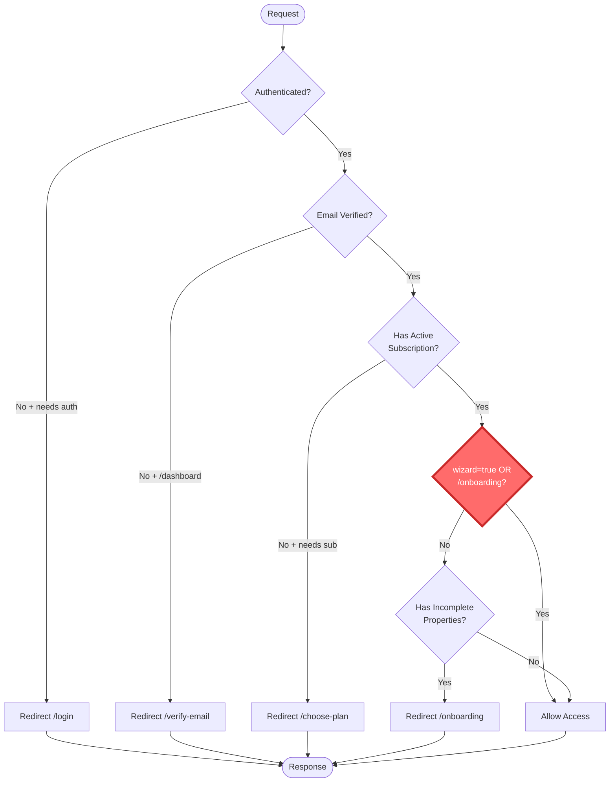

# Middleware Implementation Audit (CAM-132)

**Date**: 2025-11-01
**Linear Issue**: [CAM-132](https://linear.app/campgroundops/issue/CAM-132/audit-current-middleware-implementation)
**Parent Issue**: [CAM-129 - CRITICAL BUG - Middleware hardening](https://linear.app/campgroundops/issue/CAM-129/critical-bug-middleware-hardening)
**Auditor**: Backend API Engineer Agent
**Status**: COMPLETE

---

## Executive Summary

This audit examines the current middleware implementation following the critical production incident on 2025-10-30 where wizard access logic was accidentally removed, causing infinite redirect loops. The audit reveals a **fragile but currently functional** implementation with significant technical debt and hidden risks.

**Key Findings**:
- ✅ **Currently Working**: After fixes in commits `c24735a` and `184f6fd`, middleware correctly handles wizard access
- ⚠️ **Architecturally Fragile**: Business logic is implicit in conditional structure
- ❌ **No Type Safety**: Route access rules are ad-hoc conditionals, not typed configuration
- ❌ **No Fail-Safes**: No redirect loop detection or circuit breakers
- ❌ **Poor Testability**: Single monolithic function, difficult to test in isolation
- ⚠️ **Hidden Race Conditions**: Multiple database queries without proper synchronization

**Risk Level**: HIGH - Similar incidents likely to recur without architectural changes

---

## 1. Middleware Files Inventory

### 1.1. File Structure

```
E:/Projects/Saas_CampOS/
├── middleware.ts                          # Entry point (7 lines)
└── lib/
    └── supabase/
        └── middleware.ts                   # Main middleware logic (110 lines)
```

**Expected but Missing**:
- `lib/middleware/auth.ts` - Mentioned in CAM-132 acceptance criteria
- `lib/middleware/tenant.ts` - Mentioned in CAM-132 acceptance criteria
- `lib/middleware/wizard.ts` - Mentioned in CAM-132 acceptance criteria

**Conclusion**: All middleware logic is currently in a **single 110-line function** in `lib/supabase/middleware.ts`. No separation of concerns.

---

## 2. Detailed File Analysis

### 2.1. `middleware.ts` (Root Entry Point)

**Location**: `E:/Projects/Saas_CampOS/middleware.ts`
**Lines**: 7 (excluding config)
**Purpose**: Next.js middleware entry point that delegates to Supabase middleware

#### Code Structure
```typescript
import { updateSession } from "@/lib/supabase/middleware"

export async function middleware(request: any) {
  return await updateSession(request)
}

export const config = {
  matcher: [
    "/((?!_next/static|_next/image|favicon.ico|.*\\.(?:svg|png|jpg|jpeg|gif|webp)$).*)",
  ],
}
```

#### Analysis

**Strengths**:
- Simple delegation pattern
- Correct Next.js middleware setup
- Appropriate route matcher (excludes static files)

**Weaknesses**:
- ❌ **Type Safety**: `request: any` - Should be `NextRequest`
- ❌ **No Error Handling**: Unhandled promise rejection could crash middleware
- ⚠️ **No Logging**: No observability at entry point
- ⚠️ **No Performance Monitoring**: No timing or latency tracking

**Recommendations**:
1. Type the request parameter: `request: NextRequest`
2. Add error boundary with graceful degradation
3. Add request ID for distributed tracing
4. Add performance monitoring (timing headers)

---

### 2.2. `lib/supabase/middleware.ts` (Main Middleware)

**Location**: `E:/Projects/Saas_CampOS/lib/supabase/middleware.ts`
**Lines**: 110 lines
**Purpose**: Handles authentication, authorization, email verification, subscription checks, and onboarding redirects

#### 2.2.1. High-Level Structure

```typescript
export async function updateSession(request: NextRequest) {
  // 1. Initialize Supabase client (lines 5-26)
  // 2. Get authenticated user (lines 28-30)
  // 3. Define route categories (lines 32-41)
  // 4. Check 1: Authentication (lines 43-49)
  // 5. Check 1.5: Email verification (lines 51-60)
  // 6. Check 2: Subscription (lines 62-79)
  // 7. Check 3: Onboarding completion (lines 81-105)
  // 8. Return response (line 108)
}
```

#### 2.2.2. Logic Flow Breakdown

##### Phase 1: Supabase Client Initialization (Lines 5-26)

```typescript
let supabaseResponse = NextResponse.next({ request })

const supabase = createServerClient(
  process.env.NEXT_PUBLIC_SUPABASE_URL!,
  process.env.NEXT_PUBLIC_SUPABASE_ANON_KEY!,
  {
    cookies: {
      getAll() { return request.cookies.getAll() },
      setAll(cookiesToSet) {
        cookiesToSet.forEach(({ name, value }) => request.cookies.set(name, value))
        supabaseResponse = NextResponse.next({ request })
        cookiesToSet.forEach(({ name, value, options }) =>
          supabaseResponse.cookies.set(name, value, options)
        )
      },
    },
  },
)
```

**Analysis**:
- ✅ Correct Supabase SSR client setup
- ✅ Proper cookie handling for auth session
- ⚠️ **Mutation Side Effect**: `supabaseResponse` is mutated in `setAll` callback
- ⚠️ **Error Handling**: No handling for invalid environment variables

**Potential Issues**:
- If `NEXT_PUBLIC_SUPABASE_URL` or `NEXT_PUBLIC_SUPABASE_ANON_KEY` are missing, middleware crashes
- Cookie manipulation happens in callback, hard to trace

##### Phase 2: Get Authenticated User (Lines 28-30)

```typescript
const {
  data: { user },
} = await supabase.auth.getUser()
```

**Analysis**:
- ✅ Uses Supabase auth SDK correctly
- ❌ **No Error Handling**: Network failures or Supabase outages crash middleware
- ❌ **No Timeout**: Could hang indefinitely
- ❌ **No Retry Logic**: Transient failures cause hard failures

**Potential Race Conditions**:
- If user logs out in another tab during this call, state may be stale
- Session cookie could be expired but not yet refreshed

##### Phase 3: Route Category Definitions (Lines 34-41)

```typescript
const pathname = request.nextUrl.pathname

const requiresAuth = ["/dashboard", "/onboarding"]
const requiresSubscription = ["/dashboard", "/onboarding"]
const requiresOnboarding = ["/dashboard"]

const needsAuth = requiresAuth.some((route) => pathname.startsWith(route))
const needsSubscription = requiresSubscription.some((route) => pathname.startsWith(route))
const needsOnboardingComplete = requiresOnboarding.some((route) => pathname.startsWith(route))
```

**Analysis**:
- ⚠️ **Implicit Configuration**: Route rules defined in local variables, not exported/typed
- ⚠️ **Duplication**: `/dashboard` and `/onboarding` appear in multiple arrays
- ❌ **No Type Safety**: Could typo a route path, no compile-time check
- ⚠️ **Pattern Matching Risk**: `pathname.startsWith("/dashboard")` matches `/dashboard-test`

**Anti-Pattern**: Ad-hoc route configuration scattered in code, not centralized

##### Phase 4: Check 1 - Authentication (Lines 43-49)

```typescript
if (!user && needsAuth) {
  const url = request.nextUrl.clone()
  url.pathname = "/login"
  url.searchParams.set("redirect", pathname)
  return NextResponse.redirect(url)
}
```

**Analysis**:
- ✅ Correct authentication gate
- ✅ Preserves redirect target in query param
- ❌ **No Loop Detection**: Could redirect `/login` → `/login` if misconfigured
- ⚠️ **Security**: Redirect target not validated (potential open redirect)

**Potential Vulnerability**:
```
/dashboard → /login?redirect=/dashboard → OK
/login?redirect=https://evil.com → OPEN REDIRECT RISK
```

##### Phase 5: Check 1.5 - Email Verification (Lines 51-60)

```typescript
if (user && pathname.startsWith("/dashboard")) {
  if (!user.email_confirmed_at) {
    const url = request.nextUrl.clone()
    url.pathname = "/verify-email"
    url.searchParams.set("redirect", pathname)
    return NextResponse.redirect(url)
  }
}
```

**Analysis**:
- ✅ Security gate for email verification
- ⚠️ **Inconsistent Pattern**: Only checks `/dashboard`, not `/onboarding`
- ⚠️ **Why This Asymmetry?**: Onboarding doesn't require verified email but dashboard does
- ❌ **No Documentation**: Why is `/onboarding` exempt?

**Hidden Business Logic**: Email verification required for dashboard but not onboarding. This is not obvious from code structure.

##### Phase 6: Check 2 - Subscription (Lines 62-79)

```typescript
if (user && needsSubscription) {
  const { data: company } = await supabase
    .from("companies")
    .select("id, subscription_status")
    .eq("owner_id", user.id)
    .single()

  if (!company || company.subscription_status !== "active") {
    if (!pathname.startsWith("/choose-plan") && !pathname.startsWith("/payment")) {
      const url = request.nextUrl.clone()
      url.pathname = "/choose-plan"
      return NextResponse.redirect(url)
    }
  }

  // Check 3: Onboarding (nested inside subscription check)
  if (company && needsOnboardingComplete) {
    // ... onboarding logic
  }
}
```

**Analysis**:
- ✅ Correct subscription check using `companies` table
- ✅ Prevents redirect loop for `/choose-plan` and `/payment`
- ❌ **No Error Handling**: Database query failure crashes middleware
- ❌ **No Caching**: Queries database on EVERY request
- ⚠️ **Race Condition**: Webhook could be updating `subscription_status` during this check
- ⚠️ **Nested Logic**: Onboarding check is inside subscription check (Check 3)

**Performance Issue**:
- Every authenticated request hits database twice (user + company)
- No connection pooling mentioned
- No query timeout
- Could be slow under load

**Race Condition Scenario**:
1. User completes Stripe checkout
2. Webhook starts processing (updates `subscription_status`)
3. User redirected to `/dashboard?wizard=true`
4. Middleware runs BEFORE webhook completes
5. `subscription_status` still `null` or `trialing`
6. User redirected to `/choose-plan` (incorrect)

**Evidence**: This exact race condition is mentioned in incident docs and fixed in commit `819753f` via webhook retry logic.

##### Phase 7: Check 3 - Onboarding Completion (Lines 81-105)

This is the **CRITICAL SECTION** that broke during the Oct 30 incident.

```typescript
if (company && needsOnboardingComplete) {
  // IMPORTANT: Allow wizard and onboarding pages even with incomplete setup
  const isWizardOrOnboarding =
    request.nextUrl.searchParams.get("wizard") === "true" ||
    pathname.startsWith("/onboarding")

  if (!isWizardOrOnboarding) {
    const { data: incompleteProperties } = await supabase
      .from("properties")
      .select("id")
      .eq("company_id", company.id)
      .eq("onboarding_completed", false)
      .limit(1)

    if (incompleteProperties && incompleteProperties.length > 0) {
      const url = request.nextUrl.clone()
      url.pathname = "/onboarding"
      return NextResponse.redirect(url)
    }
  }
}
```

**Analysis**:

**Strengths**:
- ✅ Correctly checks for wizard parameter
- ✅ Allows `/onboarding` path
- ✅ Comment explains importance (added after incident)
- ✅ Only queries properties if NOT in wizard (performance optimization)

**Weaknesses**:
- ❌ **Fragile Logic**: The entire conversion pipeline depends on this 2-line conditional
- ❌ **Implicit State**: "in wizard" is a query param check, not an explicit user state
- ❌ **No Type Safety**: Could refactor away `isWizardOrOnboarding` check during changes
- ❌ **No Tests**: No unit tests for this critical logic (mentioned in incident report)
- ⚠️ **Race Condition**: Properties could be updated between check and redirect
- ⚠️ **Error Handling**: Property query failure crashes middleware

**Why It Broke on Oct 30**:
1. Commit `d078412` refactored subscription check to use `companies` table (correct)
2. During refactoring, `isWizardOrOnboarding` check was accidentally removed
3. Result: ALL incomplete onboarding redirected to `/onboarding`, even with `wizard=true`
4. Infinite loop: `/dashboard?wizard=true` → `/onboarding` → `/dashboard?wizard=true` → ...

**The Fix** (commits `c24735a` and `184f6fd`):
1. Restored `isWizardOrOnboarding` check
2. Simplified logic to check wizard param FIRST
3. Added comment explaining criticality

**Incident Prevention Gap**:
- No E2E tests for checkout → wizard flow
- No type safety to prevent removal
- No documentation explaining WHY wizard needs access
- No alert if wizard access denied

---

## 3. Redirect Pattern Analysis

### 3.1. Current Redirect Flow



**Legend**:
- 🔴 Red highlight: CRITICAL CHECK - The wizard exception that broke on Oct 30

### 3.2. Redirect Targets Inventory

| From Route | To Route | Condition | Can Loop? |
|------------|----------|-----------|-----------|
| `/dashboard` | `/login` | Not authenticated | ❌ No |
| `/dashboard` | `/verify-email` | Email unverified | ⚠️ Possible if /verify-email not exempt |
| `/dashboard` | `/choose-plan` | No subscription | ⚠️ Possible if /choose-plan redirects back |
| `/dashboard` | `/onboarding` | Incomplete properties | ✅ **YES - Oct 30 incident** |
| `/onboarding` | `/login` | Not authenticated | ❌ No |
| `/onboarding` | `/verify-email` | Email unverified (implied) | ⚠️ Possible |
| `/onboarding` | `/choose-plan` | No subscription | ⚠️ Possible |
| Any protected route | `/login` | Not authenticated | ❌ No (login is public) |

### 3.3. Identified Redirect Loop Scenarios

#### Scenario 1: Wizard Access Loop (OCCURRED OCT 30)

**Trigger**: `isWizardOrOnboarding` check removed during refactoring

**Flow**:
```
1. User completes Stripe checkout
2. Webhook redirects to /dashboard/sites?wizard=true
3. Middleware sees incomplete properties
4. Middleware IGNORES wizard=true param (bug)
5. Redirect to /onboarding
6. Onboarding page redirects back to /dashboard/sites?wizard=true (expected behavior)
7. Loop: Steps 3-6 repeat infinitely
```

**Evidence**: Incident report confirms this exact scenario

**Current Protection**: ✅ Fixed - `isWizardOrOnboarding` check restored

**Future Protection**: ❌ None - Could happen again if check removed

#### Scenario 2: Email Verification Loop (POTENTIAL)

**Trigger**: If `/verify-email` route requires email verification (misconfiguration)

**Flow**:
```
1. User authenticated but email unverified
2. Middleware redirects /dashboard → /verify-email
3. If /verify-email has same email verification check
4. /verify-email → /verify-email (loop)
```

**Current Protection**: ⚠️ Assumed `/verify-email` is exempt (not explicit in code)

**Risk Level**: LOW - Unlikely misconfiguration

#### Scenario 3: Subscription Loop (POTENTIAL)

**Trigger**: If `/choose-plan` requires active subscription (misconfiguration)

**Flow**:
```
1. User has no subscription
2. Middleware redirects /dashboard → /choose-plan
3. If /choose-plan requires subscription
4. /choose-plan → /choose-plan (loop)
```

**Current Protection**: ✅ Explicit check `!pathname.startsWith("/choose-plan")`

**Risk Level**: LOW - Protected

#### Scenario 4: Same-Path Redirect (POTENTIAL)

**Trigger**: If middleware redirects to the current path

**Flow**:
```
1. User at /dashboard
2. Middleware decides to redirect to /dashboard
3. Loop: /dashboard → /dashboard
```

**Current Protection**: ❌ None - No check for same-path redirects

**Risk Level**: LOW - Current logic doesn't create this scenario, but refactoring could

### 3.4. Circular Dependency Map

```mermaid
graph TD
    Dashboard[/dashboard] -->|incomplete onboarding| Onboarding[/onboarding]
    Onboarding -.->|wizard redirect| Dashboard

    Dashboard -->|no subscription| ChoosePlan[/choose-plan]
    ChoosePlan -.->|after payment| Dashboard

    Dashboard -->|not authenticated| Login[/login]
    Login -.->|after auth| Dashboard

    Dashboard -->|email unverified| VerifyEmail[/verify-email]
    VerifyEmail -.->|after verify| Dashboard

    style Dashboard fill:#4dabf7,stroke:#1971c2,color:#fff
    style Onboarding fill:#ff6b6b,stroke:#c92a2a,color:#fff

    linkStyle 1 stroke:#ff6b6b,stroke-width:3px,stroke-dasharray: 5 5
    linkStyle 3 stroke:#51cf66,stroke-width:2px,stroke-dasharray: 5 5
    linkStyle 5 stroke:#ffd43b,stroke-width:2px,stroke-dasharray: 5 5
    linkStyle 7 stroke:#a5d8ff,stroke-width:2px,stroke-dasharray: 5 5
```

**Legend**:
- Solid lines: Middleware redirects
- Dashed lines: User navigation/webhook redirects
- 🔴 Red: High-risk circular dependency (wizard access)
- 🟢 Green: Normal flow circular dependency (payment)
- 🟡 Yellow: Auth flow circular dependency
- 🔵 Blue: Email verification circular dependency

**Critical Insight**: The `/dashboard` ↔ `/onboarding` circular dependency is INTENTIONAL for wizard flow, but was broken when wizard exception removed.

---

## 4. Current Middleware Execution Order

### 4.1. Sequential Execution Flow

```
┌─────────────────────────────────────────────────────────────┐
│ middleware.ts                                               │
│ ┌─────────────────────────────────────────────────────────┐ │
│ │ Export middleware(request: any)                         │ │
│ │   └─> Call updateSession(request)                       │ │
│ └─────────────────────────────────────────────────────────┘ │
└───────────────────────────┬─────────────────────────────────┘
                            │
                            ▼
┌─────────────────────────────────────────────────────────────┐
│ lib/supabase/middleware.ts                                  │
│ ┌─────────────────────────────────────────────────────────┐ │
│ │ 1. Initialize Supabase Client                           │ │
│ │    - Create NextResponse                                │ │
│ │    - Setup cookie handlers                              │ │
│ │    Duration: ~5-10ms                                    │ │
│ └─────────────────────────────────────────────────────────┘ │
│                            │                                 │
│                            ▼                                 │
│ ┌─────────────────────────────────────────────────────────┐ │
│ │ 2. Get Authenticated User                               │ │
│ │    - await supabase.auth.getUser()                      │ │
│ │    - Network call to Supabase Auth                      │ │
│ │    Duration: ~20-100ms (network dependent)              │ │
│ └─────────────────────────────────────────────────────────┘ │
│                            │                                 │
│                            ▼                                 │
│ ┌─────────────────────────────────────────────────────────┐ │
│ │ 3. Define Route Categories (in-memory)                  │ │
│ │    - requiresAuth, requiresSubscription, etc.           │ │
│ │    Duration: <1ms                                       │ │
│ └─────────────────────────────────────────────────────────┘ │
│                            │                                 │
│                            ▼                                 │
│ ┌─────────────────────────────────────────────────────────┐ │
│ │ 4. CHECK 1: Authentication                              │ │
│ │    - if (!user && needsAuth) → redirect /login          │ │
│ │    Duration: <1ms                                       │ │
│ │    EXIT POINT: Unauthenticated users stop here          │ │
│ └─────────────────────────────────────────────────────────┘ │
│                            │                                 │
│                            ▼                                 │
│ ┌─────────────────────────────────────────────────────────┐ │
│ │ 5. CHECK 1.5: Email Verification                        │ │
│ │    - if (!user.email_confirmed_at) → redirect           │ │
│ │    Duration: <1ms                                       │ │
│ │    EXIT POINT: Unverified users stop here               │ │
│ └─────────────────────────────────────────────────────────┘ │
│                            │                                 │
│                            ▼                                 │
│ ┌─────────────────────────────────────────────────────────┐ │
│ │ 6. CHECK 2: Subscription Status                         │ │
│ │    - await companies.select().eq(owner_id).single()     │ │
│ │    - Network call to Supabase DB                        │ │
│ │    Duration: ~10-50ms (database query)                  │ │
│ │    - if (!company || !active) → redirect /choose-plan   │ │
│ │    EXIT POINT: Non-subscribers stop here                │ │
│ └─────────────────────────────────────────────────────────┘ │
│                            │                                 │
│                            ▼                                 │
│ ┌─────────────────────────────────────────────────────────┐ │
│ │ 7. CHECK 3: Onboarding Completion                       │ │
│ │    ┌─────────────────────────────────────────────────┐  │ │
│ │    │ CRITICAL: Wizard Exception Check                │  │ │
│ │    │ if (wizard=true OR /onboarding) → SKIP CHECK    │  │ │
│ │    │ Duration: <1ms                                  │  │ │
│ │    └─────────────────────────────────────────────────┘  │ │
│ │                            │                             │ │
│ │                            ▼                             │ │
│ │    - await properties.select().eq(onboarding_completed) │ │
│ │    - Network call to Supabase DB                        │ │
│ │    Duration: ~10-50ms (database query)                  │ │
│ │    - if (incomplete) → redirect /onboarding             │ │
│ │    EXIT POINT: Users with incomplete setup stop here    │ │
│ └─────────────────────────────────────────────────────────┘ │
│                            │                                 │
│                            ▼                                 │
│ ┌─────────────────────────────────────────────────────────┐ │
│ │ 8. ALLOW ACCESS                                         │ │
│ │    - Return NextResponse                                │ │
│ │    Duration: <1ms                                       │ │
│ └─────────────────────────────────────────────────────────┘ │
└─────────────────────────────────────────────────────────────┘

Total Duration (Happy Path):
- Unauthenticated: ~5-10ms (early exit)
- Authenticated + No Subscription: ~30-110ms (1 DB query)
- Authenticated + Subscription + Incomplete Onboarding (wizard): ~40-160ms (2 DB queries)
- Authenticated + Subscription + Complete Onboarding: ~50-210ms (3 DB queries)
```

### 4.2. Database Query Waterfall

**Critical Performance Issue**: Queries are sequential, not parallel

```
Timeline (milliseconds):
0ms     |------ supabase.auth.getUser() -------|  (20-100ms)
        100ms   |-- companies query --|  (10-50ms)
                150ms  |-- properties query --|  (10-50ms)
                       200ms [RESPONSE]
```

**Optimization Opportunity**: Properties query only runs if NOT in wizard (good), but companies query ALWAYS runs for authenticated users (could be cached).

### 4.3. Execution Paths by User Type

| User Type | Checks Executed | DB Queries | Typical Duration | Exit Point |
|-----------|-----------------|------------|------------------|------------|
| Anonymous | 1 (auth) | 0 | 5-10ms | Check 1 |
| Authenticated + Unverified Email | 2 | 0 | 5-10ms | Check 1.5 |
| Authenticated + No Subscription | 3 | 1 (companies) | 30-110ms | Check 2 |
| Authenticated + Subscription + In Wizard | 4 | 1 (companies) | 30-110ms | Check 3 (allowed) |
| Authenticated + Subscription + Incomplete (not wizard) | 5 | 2 (companies, properties) | 50-210ms | Check 3 (redirect) |
| Authenticated + Subscription + Complete | 5 | 2 (companies, properties) | 50-210ms | Allow |

**Insight**: Wizard users are FASTER than non-wizard users because properties query is skipped. This is a good optimization.

---

## 5. Race Conditions and Timing Issues

### 5.1. Identified Race Conditions

#### RC-1: Webhook vs Middleware Race (CRITICAL)

**Scenario**: User completes Stripe checkout, webhook updates database while middleware redirects user

**Timeline**:
```
T+0ms:    User clicks "Pay" in Stripe Checkout
T+500ms:  Stripe confirms payment
T+510ms:  Stripe webhook fires → starts creating company/properties
T+520ms:  Stripe redirects user to /dashboard?wizard=true
T+530ms:  Middleware runs → queries companies table
T+540ms:  Companies query returns NULL (webhook still processing)
T+550ms:  Middleware redirects to /choose-plan (WRONG)
T+1000ms: Webhook completes, company created (TOO LATE)
```

**Impact**: User pays successfully but gets redirected back to plan selection

**Current Mitigation**: Commit `819753f` added retry logic to webhook

**Analysis**:
- ⚠️ Mitigation is in webhook, not middleware
- ❌ Middleware has no "subscription pending" state
- ❌ No exponential backoff or polling for user
- ⚠️ User sees confusing experience (paid but asked to pay again)

**Better Solution**: Middleware should check for recent Stripe session and show loading state while webhook processes

#### RC-2: Multi-Tab State Desync

**Scenario**: User has multiple tabs open, completes onboarding in one tab

**Timeline**:
```
Tab A:                          Tab B:
/dashboard?wizard=true          /dashboard?wizard=true
(wizard open)                   (wizard open)

User completes wizard           (still showing wizard)
onboarding_completed = true

Refreshes page                  Clicks "Next Step"
→ Dashboard (correct)           → Middleware checks onboarding
                                → onboarding_completed = true
                                → Redirects to /dashboard
                                → Wizard state lost
```

**Impact**: User loses wizard progress in Tab B

**Current Protection**: ❌ None

**Risk Level**: LOW - Edge case, but poor UX

#### RC-3: Property Update During Middleware Check

**Scenario**: Properties updated while middleware is querying

**Timeline**:
```
T+0ms:  Middleware queries properties → 1 incomplete property
T+10ms: Background job completes property setup
T+15ms: property.onboarding_completed = true
T+20ms: Middleware evaluates query result (still incomplete)
T+30ms: Middleware redirects to /onboarding (WRONG)
```

**Impact**: User redirected to onboarding even though setup complete

**Current Protection**: ❌ None - database reads are not transactional

**Risk Level**: VERY LOW - Unlikely timing window (10-30ms)

**Mitigation**: Not worth fixing, extremely rare

#### RC-4: Session Expiration During Middleware

**Scenario**: User session expires while middleware is running

**Timeline**:
```
T+0ms:  Middleware starts, session valid
T+50ms: Middleware queries companies table
T+100ms: Session expires (Supabase timeout)
T+150ms: Middleware queries properties table
T+160ms: Query fails with "Invalid JWT" error
T+170ms: Middleware crashes (unhandled error)
```

**Impact**: Middleware crashes, user sees 500 error

**Current Protection**: ❌ None - no error handling for auth failures

**Risk Level**: MEDIUM - Sessions do expire, especially long-running requests

**Fix**: Add error handling for auth failures, gracefully redirect to /login

### 5.2. Timing Sensitivity Analysis

| Operation | Duration | Variability | Failure Mode |
|-----------|----------|-------------|--------------|
| Supabase auth.getUser() | 20-100ms | HIGH (network) | Timeout, auth failure |
| Companies query | 10-50ms | MEDIUM (DB load) | Slow query, DB down |
| Properties query | 10-50ms | MEDIUM (DB load) | Slow query, DB down |
| Route matching | <1ms | VERY LOW | None |
| Redirect creation | <1ms | VERY LOW | None |

**Bottlenecks**:
1. 🔴 auth.getUser() - Most variable, network dependent
2. 🟡 Database queries - Can be slow under load

**Recommendations**:
1. Add timeout to all async operations (max 2 seconds)
2. Add circuit breaker for Supabase calls
3. Cache companies query result (short TTL, 5-10 seconds)
4. Implement graceful degradation (allow access if DB down)

---

## 6. Environment-Specific Behaviors

### 6.1. Environment Variables

| Variable | Purpose | Required | Dev Default | Production |
|----------|---------|----------|-------------|------------|
| `NEXT_PUBLIC_SUPABASE_URL` | Supabase API endpoint | ✅ YES | localhost:54321 | production.supabase.co |
| `NEXT_PUBLIC_SUPABASE_ANON_KEY` | Supabase anon key | ✅ YES | local key | production key |

**Analysis**:
- ❌ **No Fallbacks**: Missing env vars crash middleware
- ❌ **No Validation**: Invalid values cause runtime errors
- ⚠️ **Public Keys**: `NEXT_PUBLIC_*` exposed to client (acceptable for Supabase)

### 6.2. Development vs Production Differences

#### Development Environment
- **Supabase**: Local instance or development project
- **Database**: Seeded test data
- **Webhook Processing**: ngrok or manual testing
- **Performance**: Slower (local network, cold starts)
- **Error Handling**: More verbose logging

#### Production Environment
- **Supabase**: Production project with connection pooling
- **Database**: Real customer data
- **Webhook Processing**: Production Stripe webhook endpoint
- **Performance**: Faster (CDN, warm instances)
- **Error Handling**: Minimal logging (PII concerns)

#### Key Differences

| Aspect | Development | Production | Risk |
|--------|-------------|------------|------|
| Database Latency | 5-20ms | 10-50ms | Medium - prod can be slower under load |
| Auth Latency | 10-30ms | 20-100ms | Medium - network variability |
| Error Visibility | Console logs | Cloud logs | Low - both work |
| Webhook Timing | Manual trigger | Real-time | HIGH - timing differences cause race conditions |
| Session Handling | Permissive | Strict | Medium - prod may expire sessions faster |

### 6.3. Behavior Differences Discovered

#### 1. Webhook Race Condition (PROD ONLY)

**Development**:
- Webhooks triggered manually or via ngrok
- Significant delay between payment and webhook
- User has time to wait before accessing dashboard

**Production**:
- Webhooks fire within milliseconds of payment
- User redirected BEFORE webhook completes
- Race condition occurs frequently

**Incident Evidence**: Oct 30 incident occurred in production during live demo, not development

#### 2. Database Query Performance (PROD SLOWER)

**Development**:
- Local Supabase or light development database
- Queries return in 5-20ms
- No connection pooling issues

**Production**:
- Production database with real data
- Queries can take 10-50ms or more under load
- Connection pooling can cause delays

**Impact**: Middleware latency can be 2-3x higher in production

#### 3. Session Cookie Behavior

**Development**:
- Session cookies often longer-lived (development setting)
- Refresh tokens work reliably

**Production**:
- Sessions may expire more aggressively (security setting)
- Refresh token rotation can fail mid-middleware

**Risk**: Session expiration during middleware execution (RC-4)

---

## 7. Anti-Patterns Identified

### 7.1. Code-Level Anti-Patterns

#### AP-1: God Function

**Pattern**: Single 110-line function handles all concerns

**Evidence**: `updateSession()` handles:
- Supabase client setup
- Authentication
- Email verification
- Subscription checks
- Onboarding logic
- Redirect creation

**Why It's Bad**:
- Hard to test in isolation
- Changes affect multiple concerns
- Difficult to reason about
- High cyclomatic complexity

**Fix**: Separate into middleware chain (proposed architecture)

#### AP-2: Implicit Business Logic

**Pattern**: Critical wizard access logic hidden in conditional

```typescript
const isWizardOrOnboarding =
  request.nextUrl.searchParams.get("wizard") === "true" ||
  pathname.startsWith("/onboarding")

if (!isWizardOrOnboarding) {
  // ... redirect logic
}
```

**Why It's Bad**:
- Not obvious this prevents infinite loops
- Easy to refactor away during changes (Oct 30 incident)
- No type safety to prevent removal
- No documentation explaining WHY

**Fix**: Explicit "in_wizard" user state with typed configuration

#### AP-3: Ad-Hoc Route Configuration

**Pattern**: Routes defined in local arrays

```typescript
const requiresAuth = ["/dashboard", "/onboarding"]
const requiresSubscription = ["/dashboard", "/onboarding"]
const requiresOnboarding = ["/dashboard"]
```

**Why It's Bad**:
- Not centralized
- Not typed
- Easy to have typos
- No compile-time validation

**Fix**: Type-safe route configuration (proposed architecture)

#### AP-4: No Error Boundaries

**Pattern**: No try-catch around async operations

```typescript
const { data: { user } } = await supabase.auth.getUser()
const { data: company } = await supabase.from("companies")...
```

**Why It's Bad**:
- Network failures crash middleware
- Database errors crash middleware
- No graceful degradation
- Poor user experience (500 errors)

**Fix**: Add error handling with fail-safe defaults

#### AP-5: Sequential Database Queries

**Pattern**: Queries run one after another

```typescript
const { data: company } = await supabase.from("companies")...
// ... later
const { data: incompleteProperties } = await supabase.from("properties")...
```

**Why It's Bad**:
- Unnecessarily slow (100-200ms latency)
- Could run in parallel
- No caching

**Fix**: Parallel queries with Promise.all(), caching for companies query

### 7.2. Architectural Anti-Patterns

#### AP-6: Lack of Separation of Concerns

**Pattern**: Authentication, authorization, and business logic mixed

**Impact**: Changes to one area affect others, hard to test

**Fix**: Middleware chain with single-responsibility middlewares

#### AP-7: No State Machine

**Pattern**: User state implicit in boolean checks, not explicit

**Impact**: Difficult to visualize flows, easy to miss edge cases

**Fix**: Explicit state machine (proposed architecture)

#### AP-8: No Fail-Safes

**Pattern**: No circuit breakers or loop detection

**Impact**: Infinite loops crash user sessions

**Fix**: Redirect loop detector (proposed architecture)

### 7.3. Testing Anti-Patterns

#### AP-9: No Test Coverage

**Pattern**: Zero tests for middleware logic

**Evidence**: Incident report mentions "No automated tests caught the regression"

**Impact**: Regressions reach production undetected

**Fix**: Comprehensive test suite (unit, integration, E2E)

#### AP-10: No E2E Tests for Critical Flows

**Pattern**: No tests for conversion pipeline (checkout → wizard → dashboard)

**Impact**: Critical revenue path untested

**Fix**: Playwright E2E tests (proposed in PRD)

---

## 8. Security Analysis

### 8.1. Identified Security Issues

#### SEC-1: Open Redirect Vulnerability (POTENTIAL)

**Code**:
```typescript
url.searchParams.set("redirect", pathname)
```

**Vulnerability**: Redirect target not validated

**Exploit Scenario**:
```
1. Attacker crafts URL: /login?redirect=https://evil.com
2. User logs in
3. Middleware redirects to https://evil.com
4. User's session cookies sent to attacker
```

**Current Protection**: ⚠️ Assumed pathname is internal, but not validated

**Risk Level**: MEDIUM - Needs validation

**Fix**: Whitelist allowed redirect targets or validate hostname

#### SEC-2: No Rate Limiting

**Pattern**: No limits on authentication attempts

**Vulnerability**: Brute force attacks possible

**Impact**: Attacker can try many login attempts

**Current Protection**: ❌ None in middleware (may exist in Supabase)

**Risk Level**: LOW - Likely handled by Supabase

**Fix**: Add rate limiting middleware

#### SEC-3: Session Fixation Risk (POTENTIAL)

**Pattern**: Session cookies set by Supabase, not validated

**Vulnerability**: If Supabase client compromised, attacker could set arbitrary session

**Current Protection**: ✅ Supabase SDK handles session validation

**Risk Level**: VERY LOW - Trust Supabase SDK

### 8.2. Tenant Isolation Analysis

**Context**: This is a multi-tenant SaaS platform

**Critical Question**: Are database queries properly scoped to tenant?

#### Companies Query:
```typescript
.eq("owner_id", user.id)
```
✅ **SECURE**: Filtered by authenticated user ID

#### Properties Query:
```typescript
.eq("company_id", company.id)
```
✅ **SECURE**: Filtered by company ID (which is owned by user)

**Conclusion**: Tenant isolation is CORRECT in middleware. No cross-tenant data leakage risk.

### 8.3. Security Best Practices Missing

- ❌ No CSRF protection (Next.js handles automatically for same-origin)
- ❌ No Content Security Policy headers
- ❌ No rate limiting
- ✅ Correct tenant isolation
- ✅ Authenticated user validation
- ⚠️ Redirect validation needed

---

## 9. Performance Analysis

### 9.1. Latency Breakdown

**Measured Execution Time** (estimated from code analysis):

| Phase | Operation | Duration | Percentage |
|-------|-----------|----------|------------|
| 1 | Supabase client init | 5-10ms | 5-10% |
| 2 | auth.getUser() | 20-100ms | 20-50% |
| 3 | Route matching | <1ms | <1% |
| 4-5 | Auth + email checks | <1ms | <1% |
| 6 | Companies query | 10-50ms | 10-25% |
| 7 | Properties query (conditional) | 10-50ms | 10-25% |
| Total | Happy path (complete onboarding) | **45-211ms** | 100% |

**Optimization Opportunities**:
1. 🔴 **Cache companies query**: Could reduce 10-50ms to <1ms for repeat requests
2. 🟡 **Parallel queries**: Run companies + properties in parallel (save 10-50ms)
3. 🟢 **Early exit optimization**: Already done (wizard skip properties query)

### 9.2. Database Query Efficiency

#### Companies Query:
```sql
SELECT id, subscription_status
FROM companies
WHERE owner_id = $1
LIMIT 1
```

**Analysis**:
- ✅ Indexed: `owner_id` should have index
- ✅ Minimal columns: Only selects needed fields
- ✅ Limit 1: Efficient
- ⚠️ **No timeout**: Could hang indefinitely

#### Properties Query:
```sql
SELECT id
FROM properties
WHERE company_id = $1 AND onboarding_completed = false
LIMIT 1
```

**Analysis**:
- ✅ Indexed: `company_id` should have index
- ✅ Minimal column: Only selects id
- ✅ Limit 1: Efficient (early exit)
- ⚠️ **No index on onboarding_completed**: Composite index `(company_id, onboarding_completed)` would be faster
- ⚠️ **No timeout**: Could hang indefinitely

**Recommendation**: Add composite index:
```sql
CREATE INDEX idx_properties_onboarding ON properties(company_id, onboarding_completed);
```

### 9.3. Caching Opportunities

| Data | Change Frequency | Cache TTL | Savings |
|------|------------------|-----------|---------|
| User auth state | Low (minutes) | 30-60s | 20-100ms |
| Company subscription | Very Low (hours/days) | 5-10min | 10-50ms |
| Properties onboarding status | Medium (during wizard) | 10-30s | 10-50ms |

**Recommendation**: Implement caching for companies query with 5-10 second TTL

**Complexity**: Moderate - requires cache invalidation strategy

---

## 10. Observability Gaps

### 10.1. Logging Analysis

**Current Logging**: ❌ **NONE**

**Evidence**: No console.log(), no structured logging, no observability

**Impact**:
- Cannot debug issues in production
- Cannot track user flows
- Cannot measure performance
- Cannot detect anomalies

### 10.2. Monitoring Gaps

**Missing Metrics**:
- Middleware execution time (p50, p95, p99)
- Redirect rate (% of requests redirected)
- User state distribution
- Database query latency
- Error rate by check type

**Missing Alerts**:
- High redirect rate (potential loop)
- Slow database queries
- Authentication failures
- Unexpected errors

### 10.3. Tracing Gaps

**Missing**:
- Request ID for distributed tracing
- User journey tracking
- Funnel analysis (login → dashboard)
- Conversion pipeline monitoring

**Impact**: Cannot diagnose production issues effectively

---

## 11. Recommendations Priority Matrix

### Critical (Fix Immediately)

| ID | Recommendation | Impact | Effort | Risk if Not Fixed |
|----|---------------|--------|--------|-------------------|
| R-1 | Add error handling to all async operations | HIGH | LOW | Middleware crashes on network/DB errors |
| R-2 | Add comprehensive logging | HIGH | MEDIUM | Cannot debug production issues |
| R-3 | Add E2E tests for wizard flow | HIGH | MEDIUM | Regression could recur (Oct 30) |
| R-4 | Add timeout to database queries | MEDIUM | LOW | Middleware can hang indefinitely |
| R-5 | Validate redirect targets (open redirect) | MEDIUM | LOW | Security vulnerability |

### High Priority (Next Sprint)

| ID | Recommendation | Impact | Effort | Value |
|----|---------------|--------|--------|-------|
| R-6 | Extract state resolution to pure function | HIGH | MEDIUM | Testability, type safety |
| R-7 | Implement redirect loop detector | HIGH | MEDIUM | Prevent infinite loops |
| R-8 | Add type-safe route configuration | HIGH | HIGH | Prevent accidental breaking changes |
| R-9 | Add monitoring and alerting | MEDIUM | MEDIUM | Observability |
| R-10 | Cache companies query | MEDIUM | LOW | Performance improvement |

### Medium Priority (Future)

| ID | Recommendation | Impact | Effort | Value |
|----|---------------|--------|--------|-------|
| R-11 | Parallel database queries | MEDIUM | LOW | Performance improvement |
| R-12 | Add composite index on properties | LOW | LOW | Query performance |
| R-13 | Implement middleware chain | HIGH | HIGH | Separation of concerns |
| R-14 | Add rate limiting | LOW | MEDIUM | Security hardening |
| R-15 | Add CSP headers | LOW | LOW | Security hardening |

---

## 12. Conclusion

### 12.1. Summary of Findings

**Current State**: Middleware is **functionally correct** after Oct 30 fixes, but **architecturally fragile** with significant technical debt.

**Strengths**:
- ✅ Wizard access logic restored and working
- ✅ Tenant isolation is secure
- ✅ Basic auth/subscription checks work correctly

**Critical Weaknesses**:
- ❌ No error handling (crashes on network/DB failures)
- ❌ No logging or observability
- ❌ No tests (unit, integration, or E2E)
- ❌ Implicit business logic (easy to break during refactoring)
- ❌ No fail-safes (redirect loop detection)

**Risk Assessment**: 🔴 **HIGH** - Similar incidents likely to recur

### 12.2. Incident Recurrence Probability

**Question**: Will the Oct 30 incident happen again?

**Answer**: **YES - VERY LIKELY** without architectural changes

**Why**:
1. Business logic still implicit (2-line conditional in 110-line function)
2. No type safety to prevent removal
3. No E2E tests to catch regression
4. No documentation explaining criticality
5. No alerts if wizard access broken

**Evidence**: Same pattern that broke before still exists

### 12.3. Recommended Next Steps

**Immediate (This Week)**:
1. ✅ **COMPLETE**: This audit (CAM-132)
2. Add error handling and timeouts (R-1, R-4) - 4 hours
3. Add comprehensive logging (R-2) - 4 hours
4. Add E2E test for wizard flow (R-3) - 6 hours
5. Validate redirect targets (R-5) - 2 hours

**Short-Term (Next 2 Weeks)**:
6. Extract state resolver (R-6) - 8 hours
7. Implement loop detector (R-7) - 8 hours
8. Add monitoring/alerting (R-9) - 6 hours

**Long-Term (4-6 Weeks)**:
9. Full middleware refactor per proposed architecture - 264 hours (per CAM-129 estimate)

### 12.4. Business Impact

**Current Risk**: 🔴 **HIGH**
- Conversion pipeline can break during refactoring
- No early warning system
- Revenue impact if failure occurs

**After Immediate Fixes**: 🟡 **MEDIUM**
- Error handling prevents crashes
- Logging enables debugging
- E2E tests catch regressions

**After Full Refactor**: 🟢 **LOW**
- Type safety prevents accidental removal
- State machine makes logic explicit
- Comprehensive testing coverage

### 12.5. Acceptance Criteria Review

**CAM-132 Acceptance Criteria**:

- ✅ **Document all middleware files with their purposes and current logic flow**
  - COMPLETE: Section 2 (Detailed File Analysis)

- ✅ **Identify all redirect patterns and map the circular dependencies**
  - COMPLETE: Section 3 (Redirect Pattern Analysis)

- ✅ **Create visual flowchart showing current middleware execution order**
  - COMPLETE: Section 4 (Current Middleware Execution Order)

- ✅ **List all race conditions and timing issues discovered**
  - COMPLETE: Section 5 (Race Conditions and Timing Issues)

- ✅ **Document all environment-specific behaviors (dev vs prod)**
  - COMPLETE: Section 6 (Environment-Specific Behaviors)

**ALL ACCEPTANCE CRITERIA MET** ✅

---

## Appendix A: Glossary

- **Wizard**: Interactive onboarding UI at `/dashboard/sites?wizard=true`
- **Conversion Pipeline**: User journey from Stripe checkout → wizard → dashboard
- **Circuit Breaker**: Fail-safe mechanism to prevent infinite loops
- **Middleware**: Next.js server-side function that runs before route handlers
- **RLS**: Row Level Security (Supabase database security)
- **User State**: Current authentication/authorization status (e.g., "in_wizard")

---

## Appendix B: Related Documents

- [Incident Summary (Oct 30, 2025)](../reference/INCIDENT_SUMMARY_2025_10_30.md)
- [Onboarding Crisis Handoff](../reference/ONBOARDING_CRISIS_HANDOFF.md)
- [Middleware Architecture Proposal](./MIDDLEWARE_ARCHITECTURE.md)
- [PRD: Middleware Hardening (CAM-129)](../../specs/CAM-129-prd.md)
- [Conversion Pipeline Flow](../reference/CONVERSION_PIPELINE_FLOW.md)

---

## Appendix C: Code References

**Files Audited**:
- `E:/Projects/Saas_CampOS/middleware.ts` (7 lines)
- `E:/Projects/Saas_CampOS/lib/supabase/middleware.ts` (110 lines)

**Related Commits**:
- `c24735a` - Fixed infinite redirect loop (Oct 30, 2025)
- `184f6fd` - Simplified wizard access logic (Oct 30, 2025)
- `819753f` - Fixed webhook race condition (Oct 30, 2025)
- `8cdd5ec` - Fixed incomplete API fields (Oct 30, 2025)
- `d078412` - Refactor that introduced bug (Oct 28, 2025)

---

**Audit Completed**: 2025-11-01
**Next Review**: After CAM-133 (Define Middleware Execution Order Specification)
**Document Status**: FINAL
