# Middleware Execution Order Specification

**Issue**: CAM-129 - CRITICAL BUG - Middleware hardening
**Sub-issue**: CAM-133 - Define Middleware Execution Order Specification
**Version**: 1.0
**Last Updated**: 2025-11-01
**Status**: Approved

---

## Table of Contents

1. [Executive Summary](#executive-summary)
2. [System Architecture](#system-architecture)
3. [Middleware Execution Order](#middleware-execution-order)
4. [Decision Trees](#decision-trees)
5. [State Management Requirements](#state-management-requirements)
6. [Request Flow Examples](#request-flow-examples)
7. [Edge Cases and Error Handling](#edge-cases-and-error-handling)
8. [Critical Lessons Learned](#critical-lessons-learned)
9. [Testing Requirements](#testing-requirements)
10. [Appendix](#appendix)

---

## Executive Summary

### Purpose

This specification defines the correct and safe execution order for Next.js middleware in the CampOS multi-tenant SaaS platform. It serves as the authoritative reference to prevent critical bugs such as infinite redirect loops, race conditions, and security vulnerabilities.

### Critical Context

On October 28-30, 2025, a middleware refactor (commit `d078412`) caused a complete conversion pipeline failure by removing wizard access logic, resulting in infinite redirect loops that prevented new customers from completing onboarding after payment. This specification documents the correct implementation to prevent recurrence.

### Scope

This specification covers:
- Authentication verification
- Email verification gates
- Subscription status checks
- Onboarding completion checks
- Wizard access exceptions
- Multi-tenant data isolation

### Key Principles

1. **Security First**: Never bypass authentication or tenant isolation
2. **Fail Safe**: Redirect to safe states (login, plan selection) on errors
3. **Wizard Exception**: The wizard IS the onboarding process - must be accessible
4. **Minimize Database Queries**: Check in order from cheapest to most expensive
5. **Idempotent Redirects**: Prevent redirect loops by checking destination states

---

## System Architecture

### Component Overview

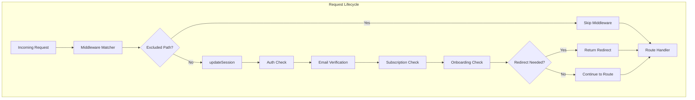

### File Structure

```
E:\Projects\Saas_CampOS\
├── middleware.ts                      # Root middleware (delegates to updateSession)
├── lib/
│   └── supabase/
│       └── middleware.ts              # Core middleware logic (updateSession)
├── app/
│   ├── (auth)/
│   │   ├── login/page.tsx            # Authentication entry
│   │   ├── signup/page.tsx           # Registration
│   │   ├── choose-plan/page.tsx      # Subscription selection
│   │   └── verify-email/page.tsx     # Email verification gate
│   ├── onboarding/page.tsx           # Onboarding redirect
│   ├── dashboard/
│   │   └── sites/page.tsx            # Contains WizardContainer
│   └── api/
│       └── stripe/
│           └── webhook/route.ts      # Creates companies/properties
```

---

## Middleware Execution Order

### Sequential Check Flow

The middleware executes checks in this **exact order**. Each check is dependent on the previous checks passing.

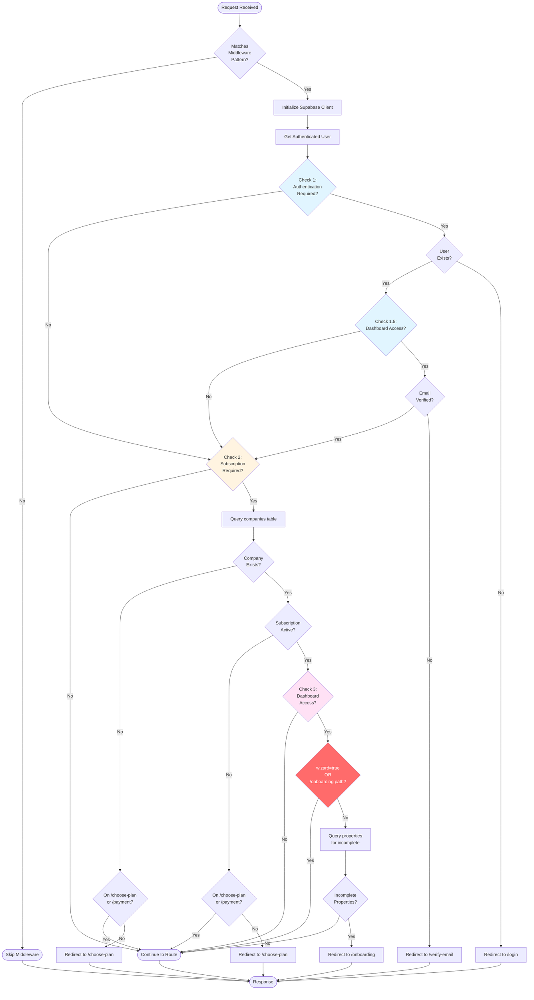

### Execution Order Rationale

| Order | Check | Rationale | Cost |
|-------|-------|-----------|------|
| 1 | Authentication | Must verify user identity before any other checks | Free (cached) |
| 1.5 | Email Verification | Security gate - must verify email before dashboard access | Free (user object) |
| 2 | Subscription Status | Must verify payment before allowing access to paid features | 1 DB query |
| 3 | Onboarding Completion | Only check if all previous checks pass | 1-2 DB queries |

**Critical**: Order minimizes database queries and prevents cascading failures.

---

## Decision Trees

### Check 1: Authentication Required

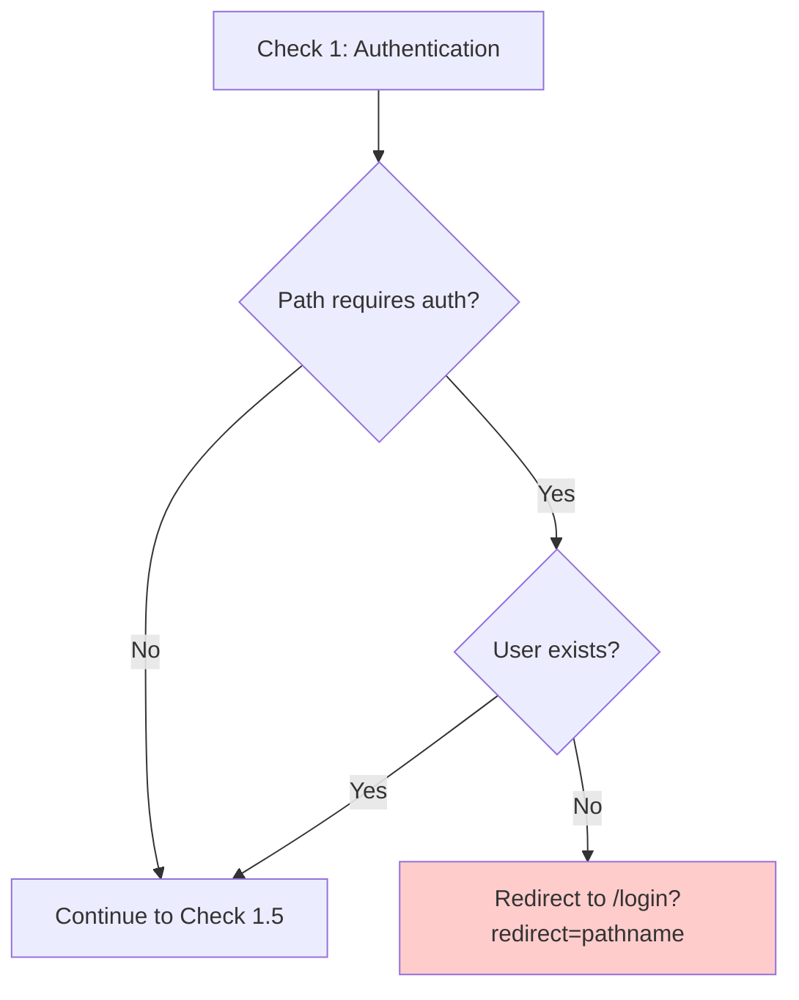

**Paths Requiring Auth**:
- `/dashboard/*`
- `/onboarding/*`

**State Requirements**:
- Input: `request.nextUrl.pathname`, `user` object from `supabase.auth.getUser()`
- Output: Continue or redirect to `/login?redirect={pathname}`

**Code Reference**:
```typescript
const requiresAuth = ["/dashboard", "/onboarding"]
const needsAuth = requiresAuth.some((route) => pathname.startsWith(route))

if (!user && needsAuth) {
  const url = request.nextUrl.clone()
  url.pathname = "/login"
  url.searchParams.set("redirect", pathname)
  return NextResponse.redirect(url)
}
```

---

### Check 1.5: Email Verification Required

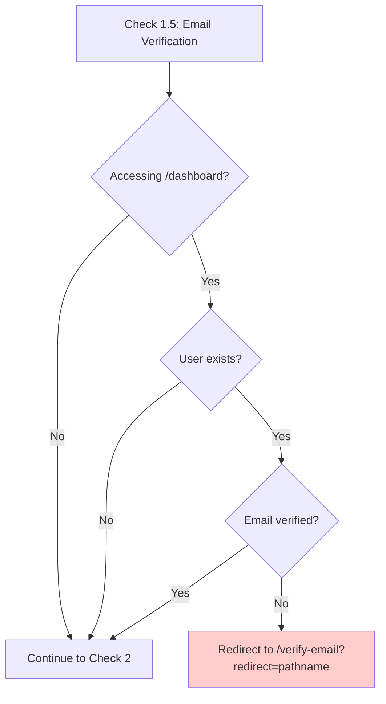

**Purpose**: Security gate preventing unverified users from accessing dashboard

**State Requirements**:
- Input: `user.email_confirmed_at` timestamp
- Output: Continue or redirect to `/verify-email?redirect={pathname}`

**Code Reference**:
```typescript
if (user && pathname.startsWith("/dashboard")) {
  if (!user.email_confirmed_at) {
    const url = request.nextUrl.clone()
    url.pathname = "/verify-email"
    url.searchParams.set("redirect", pathname)
    return NextResponse.redirect(url)
  }
}
```

**Critical Note**: This check MUST happen after authentication but before subscription checks to prevent authenticated-but-unverified users from accessing paid features.

---

### Check 2: Subscription Required

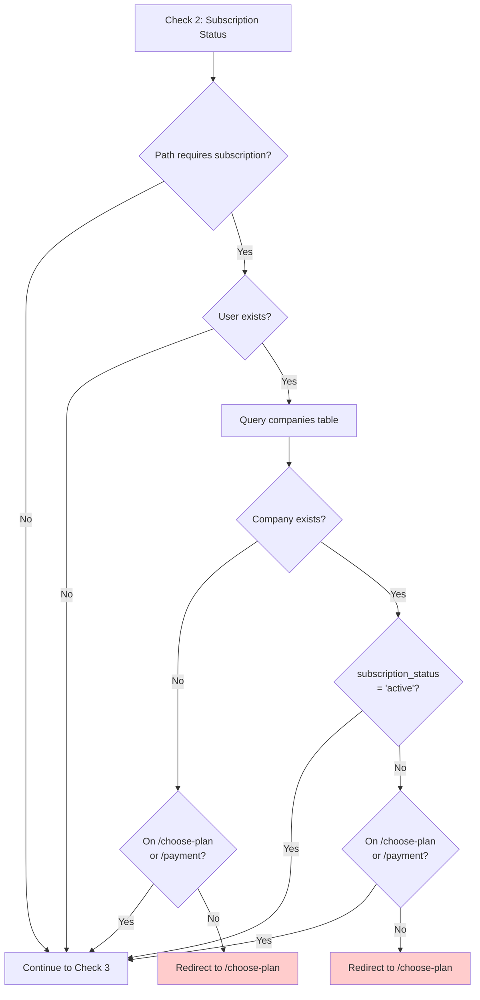

**Paths Requiring Subscription**:
- `/dashboard/*`
- `/onboarding/*`

**Exception Paths** (skip redirect even without subscription):
- `/choose-plan/*`
- `/payment/*`

**State Requirements**:
- Input: `user.id`
- Query: `companies` table WHERE `owner_id = user.id`
- Output: `company` object with `{ id, subscription_status }`

**Code Reference**:
```typescript
const requiresSubscription = ["/dashboard", "/onboarding"]
const needsSubscription = requiresSubscription.some((route) => pathname.startsWith(route))

if (user && needsSubscription) {
  const { data: company } = await supabase
    .from("companies")
    .select("id, subscription_status")
    .eq("owner_id", user.id)
    .single()

  if (!company || company.subscription_status !== "active") {
    if (!pathname.startsWith("/choose-plan") && !pathname.startsWith("/payment")) {
      const url = request.nextUrl.clone()
      url.pathname = "/choose-plan"
      return NextResponse.redirect(url)
    }
  }
}
```

**Database Schema**:
```sql
companies (
  id UUID PRIMARY KEY,
  owner_id UUID REFERENCES auth.users(id),
  subscription_status TEXT CHECK (subscription_status IN ('active', 'canceled', 'past_due')),
  stripe_customer_id TEXT,
  subscription_id TEXT,
  -- ... other fields
)
```

---

### Check 3: Onboarding Completion Required

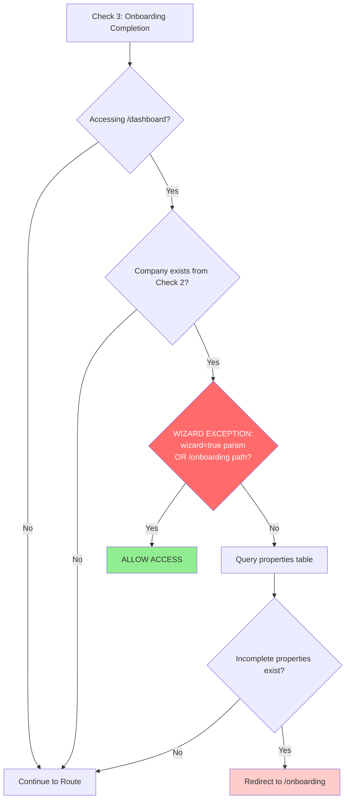

**CRITICAL - Wizard Exception Logic**:

This is the most important part of the specification. The wizard exception logic prevents infinite redirect loops while still enforcing onboarding completion.

**Why This Is Critical**:
1. After payment, users are redirected to `/dashboard/sites?wizard=true`
2. Without the wizard exception, middleware sees incomplete onboarding → redirects to `/onboarding`
3. `/onboarding` page redirects to `/dashboard/sites?wizard=true`
4. Result: **INFINITE REDIRECT LOOP** (307 redirects)

**The Solution**:
```typescript
// CRITICAL: Allow wizard and onboarding pages even with incomplete setup
// These pages ARE the onboarding process
const isWizardOrOnboarding =
  request.nextUrl.searchParams.get("wizard") === "true" ||
  pathname.startsWith("/onboarding")

if (!isWizardOrOnboarding) {
  // Only then check for incomplete properties
  const { data: incompleteProperties } = await supabase
    .from("properties")
    .select("id")
    .eq("company_id", company.id)
    .eq("onboarding_completed", false)
    .limit(1)

  if (incompleteProperties && incompleteProperties.length > 0) {
    const url = request.nextUrl.clone()
    url.pathname = "/onboarding"
    return NextResponse.redirect(url)
  }
}
```

**State Requirements**:
- Input:
  - `company.id` from Check 2
  - `request.nextUrl.searchParams.get("wizard")`
  - `pathname`
- Query: `properties` table WHERE `company_id = company.id AND onboarding_completed = false`
- Output: Continue or redirect to `/onboarding`

**Database Schema**:
```sql
properties (
  id UUID PRIMARY KEY,
  company_id UUID REFERENCES companies(id),
  owner_id UUID REFERENCES auth.users(id),
  onboarding_completed BOOLEAN DEFAULT false,
  -- ... other fields
)
```

**Historical Context**:

This check was accidentally removed in commit `d078412` (Oct 28, 2025) during a billing architecture refactor. The removal caused a production incident where:
- New customers could not access the onboarding wizard after payment
- Infinite 307 redirect loops prevented dashboard access
- Complete conversion pipeline failure during live demo

The fix was deployed in commits `c24735a` and `184f6fd` (Oct 30, 2025).

---

## State Management Requirements

### Session State

```typescript
interface MiddlewareState {
  // From Supabase Auth
  user: {
    id: string
    email: string
    email_confirmed_at: string | null
    user_metadata: {
      user_type?: 'buyer' | 'explorer'
    }
  } | null

  // From Database Queries
  company: {
    id: string
    subscription_status: 'active' | 'canceled' | 'past_due'
  } | null

  incompleteProperties: Array<{ id: string }> | null

  // From Request
  pathname: string
  searchParams: URLSearchParams
}
```

### Data Flow

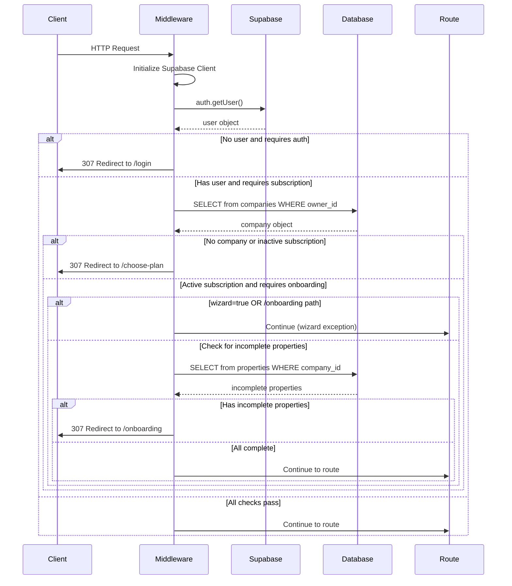

### Cookie Management

**Supabase Session Cookies**:
```typescript
const supabase = createServerClient(
  process.env.NEXT_PUBLIC_SUPABASE_URL!,
  process.env.NEXT_PUBLIC_SUPABASE_ANON_KEY!,
  {
    cookies: {
      getAll() {
        return request.cookies.getAll()
      },
      setAll(cookiesToSet) {
        cookiesToSet.forEach(({ name, value }) =>
          request.cookies.set(name, value)
        )
        supabaseResponse = NextResponse.next({ request })
        cookiesToSet.forEach(({ name, value, options }) =>
          supabaseResponse.cookies.set(name, value, options)
        )
      },
    },
  }
)
```

**Critical**: Cookie updates must be applied to both the request AND the response to ensure session consistency.

---

## Request Flow Examples

### Example 1: New User - Complete Onboarding Flow

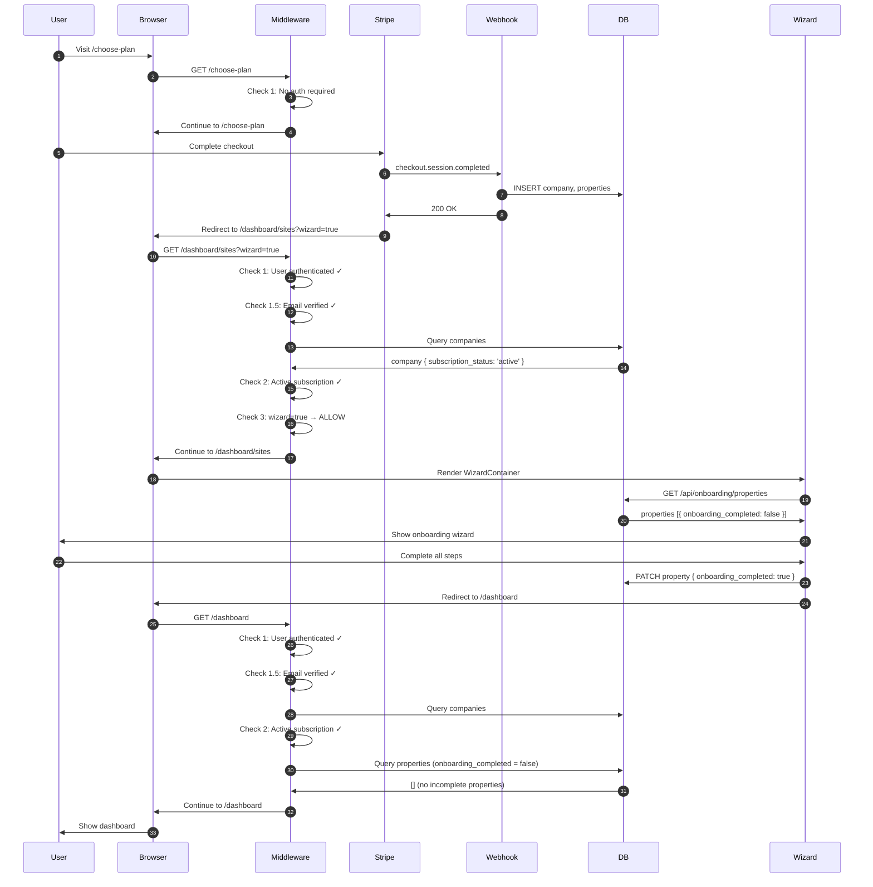

**Outcome**: ✅ User successfully completes onboarding without any redirect loops

---

### Example 2: Unauthenticated User Accessing Dashboard

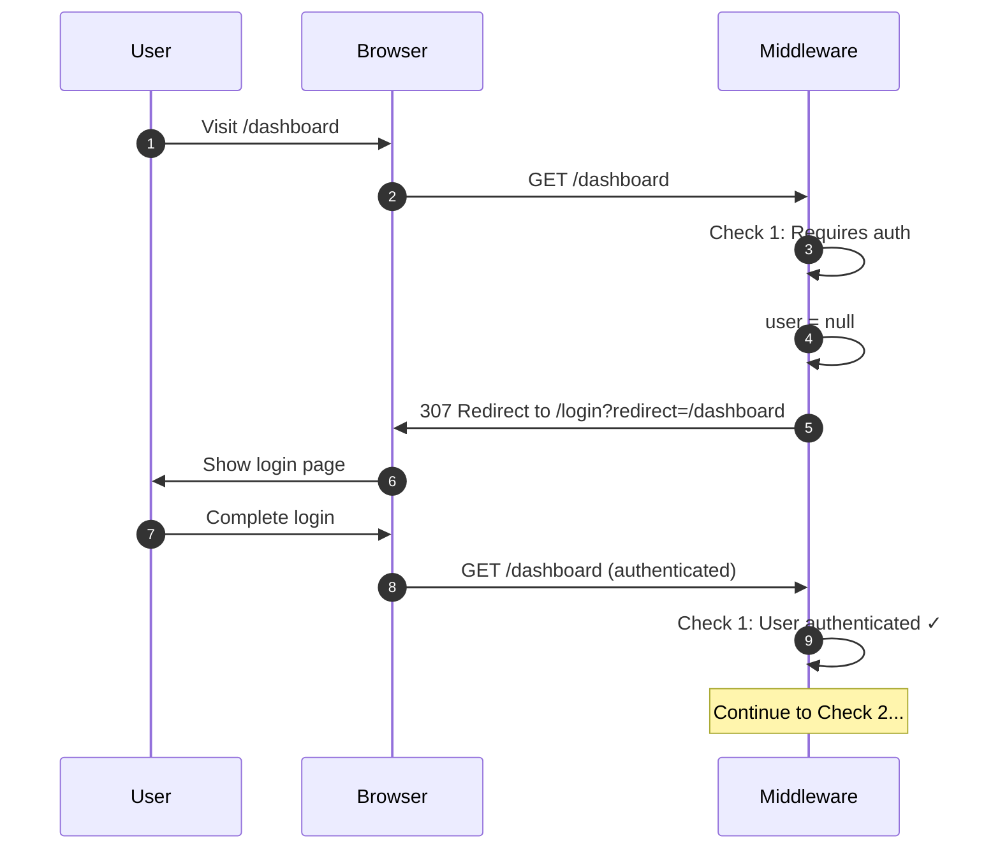

**Outcome**: ✅ User redirected to login, then back to intended destination

---

### Example 3: Authenticated User Without Subscription

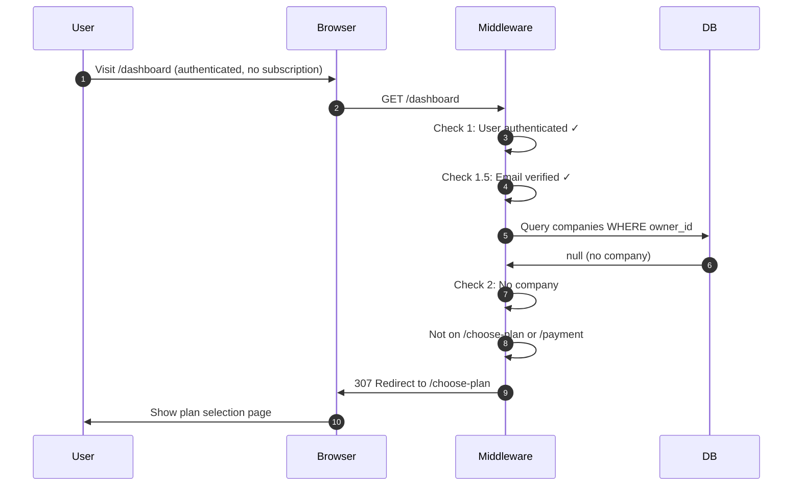

**Outcome**: ✅ User redirected to plan selection to complete payment

---

### Example 4: User with Incomplete Onboarding (Normal Access)

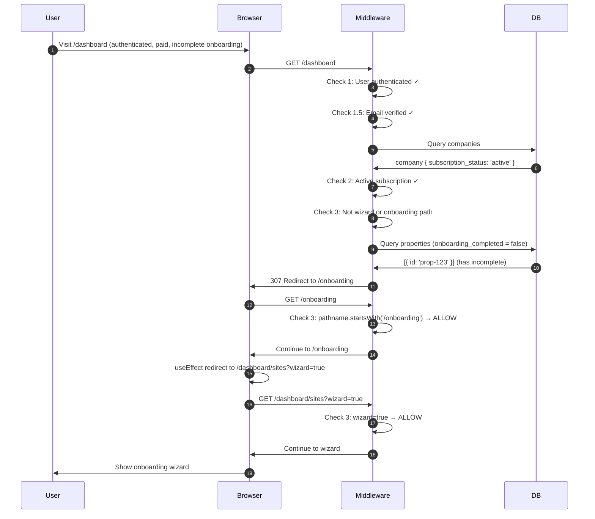

**Outcome**: ✅ User redirected to onboarding, then to wizard without loops

---

### Example 5: BROKEN Flow - Infinite Redirect Loop (Historical)

**This is what happened in commit `d078412` before the fix:**

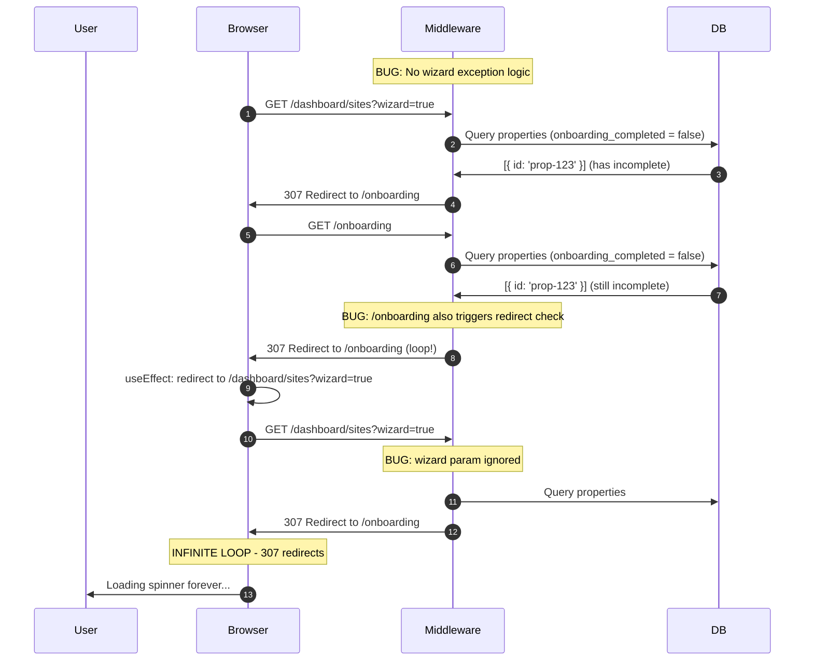

**Outcome**: ❌ Infinite redirect loop, wizard never loads

**The Fix**:
```typescript
// ADDED in commit 184f6fd:
const isWizardOrOnboarding =
  request.nextUrl.searchParams.get("wizard") === "true" ||
  pathname.startsWith("/onboarding")

if (!isWizardOrOnboarding) {
  // Only then check for incomplete properties
}
```

---

## Edge Cases and Error Handling

### Edge Case 1: Race Condition - Webhook Creates Company While User in Middleware

**Scenario**: User completes Stripe checkout. Stripe fires webhook and redirects browser simultaneously. Browser reaches middleware before webhook completes database write.

**Timeline**:
```
t=0ms:    Stripe checkout completes
t=10ms:   Stripe fires webhook (checkout.session.completed)
t=15ms:   Browser redirected to /dashboard/sites?wizard=true
t=20ms:   Browser request reaches middleware
t=50ms:   Middleware queries companies table → NULL (webhook hasn't written yet)
t=100ms:  Webhook writes company to database
```

**Problem**: Middleware redirects to `/choose-plan` because no company exists yet.

**Current Mitigation**:
- Webhook includes retry logic (3 attempts, 500ms delays) for subsequent events
- Initial `checkout.session.completed` creates company first
- Browser redirect from Stripe includes delay

**Recommended Solution**:
```typescript
// In middleware Check 2:
if (!company) {
  // Check if user just completed checkout (within last 30 seconds)
  const recentCheckout = request.cookies.get('checkout_completed')
  if (recentCheckout) {
    // Add retry logic for race condition
    await new Promise(resolve => setTimeout(resolve, 500))
    const { data: retryCompany } = await supabase
      .from("companies")
      .select("id, subscription_status")
      .eq("owner_id", user.id)
      .single()

    if (retryCompany) {
      company = retryCompany
    }
  }
}
```

---

### Edge Case 2: Multiple Incomplete Properties

**Scenario**: User has multiple properties, some complete and some incomplete.

**Current Behavior**:
```typescript
const { data: incompleteProperties } = await supabase
  .from("properties")
  .select("id")
  .eq("company_id", company.id)
  .eq("onboarding_completed", false)
  .limit(1)  // Only need to know if ANY incomplete exist
```

**Handling**:
- Middleware only checks if ANY incomplete properties exist (efficient)
- Wizard handles showing all properties and allowing user to complete each one
- Once ALL properties are complete, middleware allows dashboard access

**Optimization**: Using `.limit(1)` prevents full table scan when company has many properties.

---

### Edge Case 3: User Manually Navigates to /onboarding After Completion

**Scenario**: User completes all onboarding, then manually visits `/onboarding` URL.

**Flow**:
```
1. GET /onboarding
2. Middleware Check 3: pathname.startsWith('/onboarding') → ALLOW
3. Page loads
4. Page's useEffect redirects to /dashboard/sites?wizard=true
5. Middleware Check 3: wizard=true → ALLOW
6. Wizard loads
7. Wizard queries properties, sees all complete
8. Wizard shows "Setup already complete" message
9. Wizard redirects to /dashboard
```

**Outcome**: ✅ Gracefully handled - user not stuck, redirected to dashboard

---

### Edge Case 4: Subscription Becomes Inactive Mid-Session

**Scenario**: User is logged in and using dashboard. Subscription is canceled (payment failed, manual cancellation).

**Current Behavior**:
- Middleware runs on EVERY page navigation
- User navigates to new page → middleware checks subscription status
- Sees `subscription_status != 'active'` → redirects to `/choose-plan`

**User Experience**:
- User can finish current task
- On next navigation, redirected to plan selection
- Clear message: "Your subscription is inactive"

**Database Update Flow**:
```
1. Stripe webhook: invoice.payment_failed
2. Update companies SET subscription_status = 'past_due'
3. Next middleware check picks up new status
4. User redirected to /choose-plan with message
```

---

### Edge Case 5: Email Verification Link Clicked After Session Expires

**Scenario**: User signs up, receives verification email, waits several days, then clicks link.

**Flow**:
```
1. Click verification link → /auth/callback?verified=true
2. Callback checks for user session
3. Session expired → user = null
4. Callback redirects to /login?error=Session expired
5. User logs in again
6. Email now verified (Supabase updated automatically)
7. Login redirects to /dashboard
8. Middleware Check 1.5: email_confirmed_at exists → ALLOW
```

**Outcome**: ✅ User re-authenticates, verification persists

---

### Error Handling Patterns

#### Pattern 1: Graceful Degradation

```typescript
// If database query fails, fail OPEN for better UX
const { data: company, error } = await supabase
  .from("companies")
  .select("id, subscription_status")
  .eq("owner_id", user.id)
  .single()

if (error) {
  console.error('[Middleware] Database error:', error)
  // Log to monitoring service
  // Continue to route (fail open) rather than redirect to error page
  return supabaseResponse
}
```

**Rationale**: Brief database outage shouldn't lock users out completely. Better to allow access and risk one unauthorized request than block all users.

#### Pattern 2: Idempotent Redirects

```typescript
// WRONG - can cause redirect loops:
if (needsOnboarding) {
  return NextResponse.redirect(new URL('/onboarding', request.url))
}

// RIGHT - check if already on destination:
if (needsOnboarding) {
  if (!pathname.startsWith('/onboarding')) {
    return NextResponse.redirect(new URL('/onboarding', request.url))
  }
}
```

#### Pattern 3: Preserve Intent with Redirect Params

```typescript
// Always preserve where user was trying to go
if (!user && needsAuth) {
  const url = request.nextUrl.clone()
  url.pathname = "/login"
  url.searchParams.set("redirect", pathname)  // Preserve original destination
  return NextResponse.redirect(url)
}

// Then in /login page after successful auth:
const redirect = searchParams.get('redirect') || '/dashboard'
router.push(redirect)
```

---

## Critical Lessons Learned

### Lesson 1: The Wizard IS the Onboarding Process

**Problem**: Treating the wizard as a protected route that requires completed onboarding creates a logical impossibility.

**Root Cause**: Confusion about wizard's role:
- ❌ "Wizard is a dashboard feature that requires completed setup"
- ✅ "Wizard IS the setup process - must be accessible during setup"

**Rule**: Any route involved in completing a requirement must be EXEMPT from that requirement check.

**Application**:
```typescript
// Routes that ARE the onboarding process:
const isWizardOrOnboarding =
  request.nextUrl.searchParams.get("wizard") === "true" ||
  pathname.startsWith("/onboarding")

// Exempt these from the onboarding completion check
if (!isWizardOrOnboarding) {
  // Check for incomplete onboarding
}
```

---

### Lesson 2: Order Matters - Minimize Database Queries

**Problem**: Querying database before checking route exceptions wastes resources.

**Wrong Order**:
```typescript
// ❌ BAD: Query first
const { data: incompleteProperties } = await supabase
  .from("properties")
  .select("id")
  .eq("company_id", company.id)
  .eq("onboarding_completed", false)

if (!isWizardOrOnboarding && incompleteProperties.length > 0) {
  // redirect
}
```

**Right Order**:
```typescript
// ✅ GOOD: Check exception first
if (!isWizardOrOnboarding) {
  const { data: incompleteProperties } = await supabase
    .from("properties")
    .select("id")
    .eq("company_id", company.id)
    .eq("onboarding_completed", false)

  if (incompleteProperties && incompleteProperties.length > 0) {
    // redirect
  }
}
```

**Impact**: Saves database query on EVERY wizard page load (could be dozens per onboarding session).

---

### Lesson 3: Test the Critical Path End-to-End

**Problem**: Architectural refactors focused on schema correctness but didn't test actual user flow.

**What Happened**:
- Commit `d078412` correctly moved billing from property-level to company-level
- Tests passed (unit tests for billing logic)
- BUT: Didn't test the complete flow: Payment → Webhook → Wizard Access
- Result: Infinite redirect loops in production

**Prevention**:
```typescript
// tests/e2e/conversion-pipeline.spec.ts
test("new user can complete onboarding after payment", async ({ page }) => {
  // 1. Select plan
  await page.goto('/choose-plan')
  await page.click('[data-plan="growth"]')

  // 2. Complete Stripe checkout (test mode)
  // ... Stripe interaction

  // 3. CRITICAL: Verify no redirect loops
  await page.waitForURL(/\/dashboard\/sites\?wizard=true/, { timeout: 10000 })

  // 4. Verify wizard loads
  await expect(page.locator('[data-testid="wizard-container"]')).toBeVisible()

  // 5. Complete wizard steps
  // ...

  // 6. Verify final redirect
  await expect(page).toHaveURL('/dashboard')
})
```

---

### Lesson 4: Document Non-Obvious Business Logic

**Problem**: Critical exception logic buried in code without explanation.

**Before**:
```typescript
// No comment explaining WHY this check exists
if (request.nextUrl.searchParams.get("wizard") === "true") {
  // ...
}
```

**After**:
```typescript
// CRITICAL: The onboarding wizard MUST be accessible even when
// onboarding_completed = false. The wizard IS the onboarding process.
// Breaking this check will prevent new customers from completing setup.
//
// This check was accidentally removed in commit d078412, causing a
// production incident where customers couldn't access the wizard after payment.
//
// DO NOT REMOVE without verifying:
// 1. E2E test coverage for wizard access
// 2. Manual testing of complete conversion pipeline
// 3. Review with product team
const isWizardOrOnboarding =
  request.nextUrl.searchParams.get("wizard") === "true" ||
  pathname.startsWith("/onboarding")
```

**Impact**: Future developers understand the "why", not just the "what".

---

### Lesson 5: Redirect Loops Are Silent Killers

**Problem**: Redirect loops manifest as infinite loading spinners with no error message.

**User Experience**:
- No error shown
- Loading spinner spins forever
- Browser console shows hundreds of 307 redirects
- User thinks app is broken, not that they're stuck in a loop

**Detection**:
```typescript
// In middleware or monitoring:
const redirectCount = parseInt(request.headers.get('x-redirect-count') || '0')
if (redirectCount > 5) {
  console.error('[Middleware] Possible redirect loop detected')
  // Redirect to error page with clear message
  return NextResponse.redirect(new URL('/error?reason=redirect_loop', request.url))
}

// Increment counter
const response = NextResponse.redirect(url)
response.headers.set('x-redirect-count', (redirectCount + 1).toString())
```

**Prevention**:
1. Every redirect must have an exit condition
2. Never redirect to same path that triggered redirect
3. Use query params or path checks to break loops
4. Monitor redirect counts in production

---

## Testing Requirements

### Unit Tests (Middleware Logic)

```typescript
// tests/middleware/auth-check.test.ts
describe('Middleware - Check 1: Authentication', () => {
  test('redirects to /login when accessing /dashboard without auth', async () => {
    const request = createMockRequest({ pathname: '/dashboard', user: null })
    const response = await updateSession(request)

    expect(response.status).toBe(307)
    expect(response.headers.get('location')).toBe('/login?redirect=/dashboard')
  })

  test('allows /dashboard access when authenticated', async () => {
    const request = createMockRequest({
      pathname: '/dashboard',
      user: { id: 'user-123', email_confirmed_at: new Date().toISOString() }
    })
    const response = await updateSession(request)

    expect(response.status).toBe(200) // Continue
  })
})

describe('Middleware - Check 3: Wizard Exception', () => {
  test('allows /dashboard/sites?wizard=true even with incomplete onboarding', async () => {
    const request = createMockRequest({
      pathname: '/dashboard/sites',
      searchParams: new URLSearchParams('wizard=true'),
      user: mockUser,
      company: { id: 'company-123', subscription_status: 'active' }
    })

    const response = await updateSession(request)
    expect(response.status).toBe(200) // Continue, no redirect
  })

  test('redirects /dashboard to /onboarding with incomplete setup', async () => {
    const request = createMockRequest({
      pathname: '/dashboard',
      user: mockUser,
      company: { id: 'company-123', subscription_status: 'active' }
    })

    // Mock database to return incomplete property
    mockSupabase.from('properties').select().eq().eq().limit().mockResolvedValue({
      data: [{ id: 'prop-123' }]
    })

    const response = await updateSession(request)
    expect(response.status).toBe(307)
    expect(response.headers.get('location')).toBe('/onboarding')
  })
})
```

### Integration Tests (Database + Middleware)

```typescript
// tests/integration/middleware-flow.test.ts
describe('Middleware Integration Tests', () => {
  beforeEach(async () => {
    await resetTestDatabase()
  })

  test('complete conversion flow: signup → payment → wizard access', async () => {
    // 1. Create test user
    const user = await createTestUser({ email: 'test@example.com' })

    // 2. Simulate webhook creating company/property
    await createTestCompany({
      owner_id: user.id,
      subscription_status: 'active'
    })
    await createTestProperty({
      owner_id: user.id,
      onboarding_completed: false
    })

    // 3. Test middleware allows wizard access
    const request = createAuthenticatedRequest({
      pathname: '/dashboard/sites',
      searchParams: new URLSearchParams('wizard=true'),
      userId: user.id
    })

    const response = await updateSession(request)
    expect(response.status).toBe(200) // No redirect
  })

  test('blocks dashboard access without completed onboarding', async () => {
    const user = await createTestUser()
    await createTestCompany({ owner_id: user.id })
    await createTestProperty({
      owner_id: user.id,
      onboarding_completed: false
    })

    const request = createAuthenticatedRequest({
      pathname: '/dashboard',
      userId: user.id
    })

    const response = await updateSession(request)
    expect(response.status).toBe(307)
    expect(response.headers.get('location')).toBe('/onboarding')
  })
})
```

### End-to-End Tests (Full User Journey)

```typescript
// tests/e2e/conversion-pipeline.spec.ts
import { test, expect } from '@playwright/test'

test.describe('Conversion Pipeline E2E', () => {
  test('new user completes full onboarding without redirect loops', async ({ page }) => {
    // 1. Sign up
    await page.goto('/signup')
    await page.fill('[name="email"]', 'test@example.com')
    await page.fill('[name="password"]', 'SecurePass123!')
    await page.click('button[type="submit"]')

    // 2. Select plan
    await expect(page).toHaveURL(/\/choose-plan/)
    await page.click('[data-plan="growth"]')

    // 3. Complete Stripe checkout (test mode)
    await page.fill('[name="cardNumber"]', '4242424242424242')
    await page.fill('[name="cardExpiry"]', '12/34')
    await page.fill('[name="cardCvc"]', '123')
    await page.click('button:has-text("Subscribe")')

    // 4. CRITICAL: Wait for redirect to wizard WITHOUT infinite loop
    await page.waitForURL(/\/dashboard\/sites\?wizard=true/, {
      timeout: 10000
    })

    // 5. Verify no redirect loop (URL stable for 2 seconds)
    await page.waitForTimeout(2000)
    expect(page.url()).toContain('/dashboard/sites?wizard=true')

    // 6. Verify wizard loads
    await expect(page.locator('[data-testid="wizard-container"]')).toBeVisible()

    // 7. Complete wizard steps
    // ... step-by-step wizard interaction

    // 8. Verify completion redirect
    await expect(page).toHaveURL('/dashboard')
    await expect(page.locator('text=Setup complete!')).toBeVisible()
  })

  test('prevents access to dashboard without completed onboarding', async ({ page }) => {
    // Setup: User with active subscription but incomplete onboarding
    const user = await createTestUser()
    await loginAs(page, user)

    // Navigate directly to dashboard
    await page.goto('/dashboard')

    // Should be redirected to onboarding
    await expect(page).toHaveURL(/\/onboarding/)

    // Onboarding redirects to wizard
    await expect(page).toHaveURL(/\/dashboard\/sites\?wizard=true/)
  })
})
```

### Security Tests (Tenant Isolation)

```typescript
// tests/security/middleware-isolation.test.ts
describe('Middleware Security - Tenant Isolation', () => {
  test('user cannot access another tenant dashboard', async () => {
    const user1 = await createTestUser({ email: 'user1@example.com' })
    const user2 = await createTestUser({ email: 'user2@example.com' })

    const company1 = await createTestCompany({ owner_id: user1.id })
    const company2 = await createTestCompany({ owner_id: user2.id })

    // User1 tries to access dashboard
    const request = createAuthenticatedRequest({
      pathname: '/dashboard',
      userId: user1.id
    })

    const response = await updateSession(request)

    // Should only see own company data
    const { data: companyCheck } = await supabase
      .from('companies')
      .select('id')
      .eq('owner_id', user1.id)
      .single()

    expect(companyCheck.id).toBe(company1.id)
    expect(companyCheck.id).not.toBe(company2.id)
  })
})
```

---

## Appendix

### A. Environment Variables

```env
# Supabase
NEXT_PUBLIC_SUPABASE_URL=https://xxx.supabase.co
NEXT_PUBLIC_SUPABASE_ANON_KEY=xxx
SUPABASE_SERVICE_ROLE_KEY=xxx (server-only)

# Stripe
STRIPE_SECRET_KEY=sk_test_xxx
STRIPE_WEBHOOK_SECRET=whsec_xxx

# App
NEXT_PUBLIC_APP_URL=https://yourapp.com (for redirects)
```

### B. Database Schema (Relevant Tables)

```sql
-- Users (managed by Supabase Auth)
auth.users (
  id UUID PRIMARY KEY,
  email TEXT,
  email_confirmed_at TIMESTAMPTZ,
  user_metadata JSONB
)

-- Companies (billing entity)
companies (
  id UUID PRIMARY KEY,
  owner_id UUID REFERENCES auth.users(id),
  name TEXT,
  stripe_customer_id TEXT UNIQUE,
  subscription_id TEXT,
  subscription_status TEXT CHECK (subscription_status IN ('active', 'canceled', 'past_due')),
  subscription_plan TEXT,
  subscription_created_at TIMESTAMPTZ,
  billing_cycle TEXT,
  created_at TIMESTAMPTZ DEFAULT now()
)

-- Properties (campground locations)
properties (
  id UUID PRIMARY KEY,
  company_id UUID REFERENCES companies(id),
  owner_id UUID REFERENCES auth.users(id),
  name TEXT,
  slug TEXT UNIQUE,
  site_count INTEGER,
  onboarding_completed BOOLEAN DEFAULT false,
  wizard_step_completed TEXT,
  created_at TIMESTAMPTZ DEFAULT now()
)

-- Subscription Events (audit log)
subscription_events (
  id UUID PRIMARY KEY,
  company_id UUID REFERENCES companies(id),
  event_type TEXT,
  stripe_event_id TEXT,
  event_data JSONB,
  created_at TIMESTAMPTZ DEFAULT now()
)
```

### C. Middleware Matcher Configuration

```typescript
// middleware.ts
export const config = {
  matcher: [
    /*
     * Match all request paths except for the ones starting with:
     * - _next/static (static files)
     * - _next/image (image optimization files)
     * - favicon.ico (favicon file)
     * - *.svg, *.png, *.jpg, *.jpeg, *.gif, *.webp (images)
     */
    "/((?!_next/static|_next/image|favicon.ico|.*\\.(?:svg|png|jpg|jpeg|gif|webp)$).*)",
  ],
}
```

**Why This Matcher**:
- Excludes static assets (no need for auth checks)
- Excludes Next.js internals (_next/*)
- Includes ALL other routes (API, pages, etc.)

**Performance**: Excluding static assets prevents thousands of unnecessary middleware executions.

### D. Redirect Status Codes

| Code | Meaning | When to Use |
|------|---------|-------------|
| 307 | Temporary Redirect | Middleware redirects (preserves HTTP method) |
| 308 | Permanent Redirect | Never use in middleware (too aggressive caching) |
| 302 | Found | Legacy, prefer 307 |
| 301 | Moved Permanently | Never use in middleware |

**Why 307**: Preserves POST requests (important for form submissions). Browser won't convert POST to GET.

### E. Monitoring Checklist

**Metrics to Track**:
- [ ] Middleware execution time (p50, p95, p99)
- [ ] Redirect rate (% of requests redirected)
- [ ] Redirect loop detection (same user, same path, >5 times)
- [ ] Database query failures in middleware
- [ ] Authentication failures
- [ ] Wizard access rate (users accessing with wizard=true)

**Alerts to Configure**:
- [ ] Middleware execution time > 500ms (p95)
- [ ] Redirect rate > 30% (indicates configuration issue)
- [ ] Redirect loop detected (immediate alert)
- [ ] Database query error rate > 1%
- [ ] Wizard access blocked (indicates regression)

**Logging**:
```typescript
// Add to middleware for production monitoring
console.log('[Middleware]', {
  pathname: request.nextUrl.pathname,
  userId: user?.id,
  check1_auth: needsAuth ? 'required' : 'skipped',
  check2_subscription: needsSubscription ? 'required' : 'skipped',
  check3_onboarding: needsOnboardingComplete ? 'required' : 'skipped',
  wizard_exception: isWizardOrOnboarding,
  redirect: redirectUrl || null,
  duration_ms: Date.now() - startTime
})
```

### F. Related Documentation

- [ONBOARDING_CRISIS_HANDOFF.md](../docs/reference/ONBOARDING_CRISIS_HANDOFF.md) - Complete incident post-mortem
- [INCIDENT_SUMMARY_2025_10_30.md](../docs/reference/INCIDENT_SUMMARY_2025_10_30.md) - Executive summary of Oct 30 incident
- [PAYMENT_FLOW_TESTING_GUIDE.md](../docs/reference/PAYMENT_FLOW_TESTING_GUIDE.md) - Testing procedures for conversion pipeline
- [CLAUDE.md](../CLAUDE.md) - Multi-tenant security requirements (C-10, T-7)

### G. Revision History

| Version | Date | Author | Changes |
|---------|------|--------|---------|
| 1.0 | 2025-11-01 | Claude Code | Initial specification based on CAM-133 requirements |

---

**END OF SPECIFICATION**

---

## Quick Reference Card

### Middleware Execution Order (TL;DR)

```
1. ✅ Check 1: Authentication Required?
   → No user? Redirect to /login

2. ✅ Check 1.5: Email Verified? (dashboard only)
   → Not verified? Redirect to /verify-email

3. ✅ Check 2: Subscription Active?
   → No company/inactive? Redirect to /choose-plan

4. ✅ Check 3: Onboarding Complete? (dashboard only)
   → EXCEPTION: Allow if wizard=true OR /onboarding path
   → Incomplete properties? Redirect to /onboarding

5. ✅ Continue to route
```

### Critical Rules

1. **Wizard Exception**: ALWAYS check for `wizard=true` OR `/onboarding` path BEFORE querying for incomplete properties
2. **Order Matters**: Auth → Email → Subscription → Onboarding
3. **Idempotent Redirects**: Never redirect to the same path that triggered the redirect
4. **Minimize Queries**: Check exceptions before querying database
5. **Fail Open**: On database errors, allow access and log error (better than locking everyone out)

### Common Pitfalls

❌ **DON'T**: Check for incomplete properties without wizard exception
❌ **DON'T**: Remove wizard exception logic (causes infinite loops)
❌ **DON'T**: Query database before checking route exceptions
❌ **DON'T**: Redirect to /onboarding from /onboarding (infinite loop)
❌ **DON'T**: Deploy middleware changes without E2E testing

✅ **DO**: Test complete conversion flow: payment → webhook → wizard
✅ **DO**: Document why critical logic exists (not just what it does)
✅ **DO**: Use wizard exception for all onboarding-related routes
✅ **DO**: Monitor redirect rates and loop detection
✅ **DO**: Add comprehensive E2E tests before refactoring

### Emergency Contacts

**If Middleware Breaks**:
1. Check browser console for 307 redirect loops
2. Check Vercel logs for middleware errors
3. Review recent commits to `middleware.ts` or `lib/supabase/middleware.ts`
4. Verify wizard exception logic is intact
5. Test with: `/dashboard/sites?wizard=true` (should load wizard)
6. Rollback if necessary: `git revert <commit-sha>`

**Reference Documents**:
- This spec: `specs/CAM-129-middleware-spec.md`
- Incident details: `docs/reference/ONBOARDING_CRISIS_HANDOFF.md`
- Testing guide: `docs/reference/PAYMENT_FLOW_TESTING_GUIDE.md`
