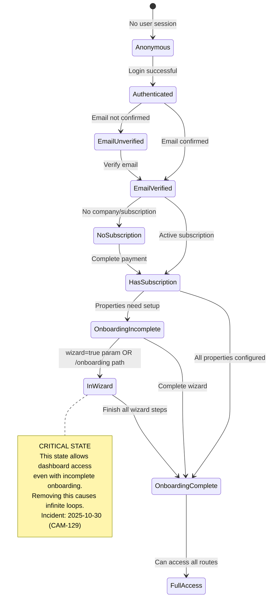

# Technical Specification: Middleware Hardening

**Linear Issue:** [CAM-129](https://linear.app/campgroundops/issue/CAM-129/critical-bug-middleware-hardening)
**PRD:** [CAM-129-prd.md](./CAM-129-prd.md)
**Version:** 1.0
**Date:** 2025-10-31
**Status:** Ready for Development
**Priority:** Urgent
**Author:** Business Analyst (AI Agent)

---

## Table of Contents

1. [Acceptance Criteria](#1-acceptance-criteria)
2. [Technical Design](#2-technical-design)
3. [UI/UX Considerations](#3-uiux-considerations)
4. [Edge Cases and Error Handling](#4-edge-cases-and-error-handling)
5. [Testing Requirements](#5-testing-requirements)
6. [Definition of Ready Checklist](#6-definition-of-ready-checklist)

---

## 1. Acceptance Criteria

### 1.1. Phase 1: Observability (Week 1)

**Given** the current middleware is in production
**When** comprehensive logging is added without behavior changes
**Then** every middleware execution produces structured JSON logs containing:
- Request path and query parameters
- User authentication status
- Company and subscription status
- Onboarding completion status
- `isInWizard` flag value
- Access decision (allow/redirect)
- Execution time in milliseconds
- Unique request ID for distributed tracing

**Success Metrics:**
- 100% of middleware decisions logged with full context
- Logs searchable by user ID, path, and state within 10 seconds
- Zero change in user-facing behavior (verified by unchanged redirect patterns)
- Can identify all wizard access instances in logs
- Baseline metrics collected: redirect rate, user state distribution, p50/p95/p99 latency

**Acceptance Test:**
```bash
# Deploy Phase 1 to production
# Monitor logs for 48 hours
# Verify log completeness
grep "Middleware decision" production.log | jq '.userState' | sort | uniq -c
# Should show distribution across all states
```

---

### 1.2. Phase 2: Loop Detection (Week 2)

**Given** comprehensive logging is in place
**When** redirect loop detector is implemented and deployed
**Then** the system automatically:
- Tracks redirect count via short-lived cookie (`redirect_count`, 10s TTL)
- Detects when redirect count exceeds 3 within 5 seconds
- Triggers circuit breaker to break the loop
- Shows user-friendly error message instead of infinite loading
- Logs full redirect history with alert
- Resets counter on successful page load

**Success Metrics:**
- Circuit breaker catches synthetic loop test scenario 100% of time
- Zero false positives in production (1 week monitoring period)
- Alert fires in Slack/email within 60 seconds when loop detected
- Users who encounter loops can proceed (fail-safe mode)
- Mean time to detection (MTTD) < 1 minute

**Acceptance Test:**
```typescript
// E2E test creates intentional loop configuration
test("loop detector triggers circuit breaker", async ({ page }) => {
  // Create misconfigured route that redirects to itself
  await createLoopScenario()

  // Attempt to access route
  await page.goto("/dashboard?wizard=true")

  // Circuit breaker should trigger after 3 redirects
  await expect(page.locator('text=configuration issue')).toBeVisible()

  // Alert should be logged
  const alerts = await getAlerts()
  expect(alerts).toContainEqual(expect.objectContaining({
    type: "REDIRECT_LOOP_DETECTED",
    severity: "critical"
  }))
})
```

---

### 1.3. Phase 3: State Resolver (Week 3)

**Given** loop detection is working correctly
**When** state resolution logic is extracted to pure function
**Then** the system:
- Calculates user state based on context in predictable order
- Returns one of 10 explicit states (typed union)
- Checks `isInWizard` BEFORE `hasIncompleteProperties` (critical ordering)
- Runs in shadow mode alongside existing logic
- Logs discrepancies between old and new state calculation
- Matches existing logic 100% before cutover

**User States (TypeScript Union):**
```typescript
type UserState =
  | "anonymous"
  | "authenticated"
  | "email_unverified"
  | "email_verified"
  | "no_subscription"
  | "has_subscription"
  | "onboarding_incomplete"
  | "in_wizard"           // CRITICAL - must be checked before onboarding_incomplete
  | "onboarding_complete"
  | "full_access"
```

**Success Metrics:**
- State resolver is pure function (100% deterministic, no side effects)
- Unit test coverage: 100% of state transitions (10 states = 90 transition tests)
- Shadow mode comparison: 100% match rate over 1 week
- Integration tests pass with real Supabase test database
- State visualization available in logs/dashboard

**Acceptance Test:**
```typescript
describe("resolveUserState", () => {
  it("should return 'in_wizard' when wizard param is true with incomplete onboarding", () => {
    const context: UserContext = {
      user: mockUser(),
      emailVerified: true,
      company: mockCompany({ subscription_status: "active" }),
      subscription: "active",
      hasIncompleteProperties: true,  // Still incomplete
      isInWizard: true                // But in wizard
    }

    const state = resolveUserState(context)

    // CRITICAL: Must be 'in_wizard', not 'onboarding_incomplete'
    // This prevents the Oct 30 incident from recurring
    expect(state).toBe("in_wizard")
  })
})
```

---

### 1.4. Phase 4: Route Configuration (Week 4)

**Given** state resolver is working correctly
**When** route access rules are defined in typed configuration
**Then** the system:
- Defines explicit access rules for all protected routes
- Uses TypeScript to enforce completeness (removing config causes build error)
- Specifies `allowInWizard: boolean` flag explicitly for all routes
- Documents WHY each access rule exists (inline comments)
- Runs in shadow mode alongside existing conditional logic
- Switches over once results match 100%

**Type-Safe Route Config:**
```typescript
type RouteConfig = {
  path: string
  requiresAuth: boolean
  requiresEmailVerification: boolean
  requiresSubscription: boolean
  requiresOnboardingComplete: boolean
  allowInWizard: boolean  // EXPLICIT FLAG - prevents accidental removal
  accessRules: Record<UserState, RouteAccess>
}

type RouteAccess =
  | { allow: true }
  | { allow: false; redirectTo: string; reason: string }
```

**Success Metrics:**
- TypeScript compilation fails if required route config missing
- Removing `allowInWizard` flag causes build error
- All 10 user states have explicit access rules for each route
- Shadow mode comparison: 100% match rate over 1 week
- E2E tests pass for all user journeys
- Breaking changes caught at build time (not runtime)

**Acceptance Test:**
```typescript
// Attempt to remove wizard access config
const DASHBOARD_ROUTES: RouteConfig = {
  path: "/dashboard",
  requiresAuth: true,
  requiresEmailVerification: true,
  requiresSubscription: true,
  requiresOnboardingComplete: false,
  // allowInWizard: true,  // ← Commented out to simulate accident
  accessRules: {
    // ... 9 states defined
    // in_wizard: { ... }  // ← Missing
  }
}

// TypeScript should error:
// Error: Type 'RouteConfig' is missing the following properties: allowInWizard
// Error: Property 'in_wizard' is missing in type accessRules
```

---

### 1.5. Phase 5: Full Cutover (Week 5)

**Given** all phases 1-4 are complete and tested
**When** new middleware is deployed to production
**Then** the system:
- Deploys to staging with full E2E test suite passing
- Canary deploys to 10% production traffic
- Monitors for 24 hours with zero increase in error rate
- Rolls out to 100% traffic
- Removes old middleware code after 1 week of stable operation

**Success Metrics:**
- Zero conversion pipeline failures (7-day monitoring period)
- Zero redirect loops detected in production
- Middleware latency p99 < 100ms (no performance regression)
- User state distribution matches pre-migration baseline
- Alert fires if wizard access is blocked
- Instant rollback available (feature flag or deployment rollback)

**Acceptance Test:**
```typescript
test("new user completes onboarding without redirect loops", async ({ page }) => {
  // 1. Complete Stripe checkout
  await completeStripeCheckout(page, {
    plan: "starter",
    properties: [{ name: "Pine Valley Campground", siteCount: 50 }]
  })

  // 2. Should redirect to wizard
  await expect(page).toHaveURL(/dashboard\/sites\?wizard=true/)

  // 3. Verify NO redirect loops (URL should be stable)
  await page.waitForLoadState("networkidle")
  const url = page.url()
  await page.waitForTimeout(2000)
  expect(page.url()).toBe(url)  // URL hasn't changed

  // 4. Wizard should load
  await expect(page.locator('[data-testid="onboarding-wizard"]')).toBeVisible()

  // 5. Complete wizard
  await completeWizardSteps(page)

  // 6. Should redirect to dashboard
  await expect(page).toHaveURL(/\/dashboard$/)
  await expect(page.locator('text=Setup Complete')).toBeVisible()
})
```

---

## 2. Technical Design

### 2.1. Architecture Overview

**Current Architecture (Fragile):**
```
Request → Single middleware function (110 lines) → Response
          ↓
          Nested conditionals with implicit business logic
          ↓
          Easy to accidentally break critical paths
```

**Proposed Architecture (Resilient):**
```
Request → State Resolver → Route Matcher → Access Checker → Loop Detector → Response
          ↓                                                   ↓
          Supabase DB                                    Logging/Alerting
          (companies, properties)                        (Structured JSON)
```

**Key Improvements:**
1. **Separation of Concerns**: State calculation, route matching, and access checking are separate
2. **Explicit State Machine**: 10 named states replace ad-hoc boolean flags
3. **Type Safety**: TypeScript enforces completeness of route configurations
4. **Fail-Safe Mechanisms**: Circuit breakers prevent catastrophic failures
5. **Observability**: Every decision logged with full context

---

### 2.2. Database Schema (No Changes Required)

**Existing Tables Used:**

```sql
-- companies table (already exists from migration 20251027130000)
CREATE TABLE companies (
  id UUID PRIMARY KEY,
  name TEXT NOT NULL,
  owner_id UUID NOT NULL REFERENCES auth.users(id),

  -- Subscription status (used by middleware)
  subscription_status TEXT CHECK (subscription_status IN ('active', 'canceled', 'past_due', 'unpaid', 'incomplete')),
  subscription_plan TEXT CHECK (subscription_plan IN ('starter', 'growth', 'pro', 'enterprise')),

  -- Indexes for middleware performance
  created_at TIMESTAMPTZ DEFAULT NOW(),
  updated_at TIMESTAMPTZ DEFAULT NOW()
);

CREATE INDEX idx_companies_owner ON companies(owner_id);

-- properties table (already exists, enhanced by migration 20251027080000)
ALTER TABLE properties
ADD COLUMN onboarding_completed BOOLEAN DEFAULT FALSE,
ADD COLUMN onboarding_completed_at TIMESTAMPTZ,
ADD COLUMN company_id UUID REFERENCES companies(id);

CREATE INDEX idx_properties_company ON properties(company_id);
CREATE INDEX idx_properties_onboarding ON properties(onboarding_completed);
```

**Middleware Queries:**

```typescript
// Query 1: Get user's company with subscription status
const { data: company } = await supabase
  .from("companies")
  .select("id, subscription_status")
  .eq("owner_id", user.id)
  .single()

// Query 2: Check for incomplete properties
const { data: incompleteProperties } = await supabase
  .from("properties")
  .select("id")
  .eq("company_id", company.id)
  .eq("onboarding_completed", false)
  .limit(1)
```

**Performance Considerations:**
- Both queries use indexed columns (`owner_id`, `company_id`, `onboarding_completed`)
- Expected latency: < 50ms per query (indexed lookups)
- Total middleware latency target: < 100ms p99

**No Schema Changes Needed**: All required columns and indexes already exist.

---

### 2.3. API Changes (Internal Only)

**No External APIs Modified**: All changes are internal to middleware logic.

**New Internal Modules:**

```typescript
// lib/middleware/types.ts
export type UserState =
  | "anonymous"
  | "authenticated"
  | "email_unverified"
  | "email_verified"
  | "no_subscription"
  | "has_subscription"
  | "onboarding_incomplete"
  | "in_wizard"
  | "onboarding_complete"
  | "full_access"

export type UserContext = {
  user: User | null
  emailVerified: boolean
  company: Company | null
  subscription: SubscriptionStatus | null
  hasIncompleteProperties: boolean
  isInWizard: boolean  // EXPLICIT FLAG
}

export type RouteAccess =
  | { allow: true }
  | { allow: false; redirectTo: string; reason: string }

export type RouteConfig = {
  path: string
  requiresAuth: boolean
  requiresEmailVerification: boolean
  requiresSubscription: boolean
  requiresOnboardingComplete: boolean
  allowInWizard: boolean
  accessRules: Record<UserState, RouteAccess>
}

// lib/middleware/state-resolver.ts
export function resolveUserState(context: UserContext): UserState {
  if (!context.user) return "anonymous"
  if (!context.emailVerified) return "email_unverified"
  if (!context.company || context.subscription !== "active") return "no_subscription"

  // CRITICAL: Check wizard state BEFORE onboarding checks
  // This prevents the Oct 30 incident from recurring
  if (context.isInWizard) return "in_wizard"

  if (context.hasIncompleteProperties) return "onboarding_incomplete"

  return "full_access"
}

// lib/middleware/route-config.ts
export const DASHBOARD_ROUTES: RouteConfig = {
  path: "/dashboard",
  requiresAuth: true,
  requiresEmailVerification: true,
  requiresSubscription: true,
  requiresOnboardingComplete: false,  // ← Allows incomplete onboarding
  allowInWizard: true,                 // ← Explicit wizard access
  accessRules: {
    anonymous: { allow: false, redirectTo: "/login", reason: "authentication_required" },
    email_unverified: { allow: false, redirectTo: "/verify-email", reason: "email_verification_required" },
    no_subscription: { allow: false, redirectTo: "/choose-plan", reason: "subscription_required" },
    onboarding_incomplete: { allow: false, redirectTo: "/onboarding", reason: "onboarding_required" },
    in_wizard: { allow: true },  // ← Wizard users CAN access dashboard
    onboarding_complete: { allow: true },
    full_access: { allow: true },
    // ... other states
  }
}

// lib/middleware/loop-detector.ts
export class RedirectLoopDetector {
  private static readonly MAX_REDIRECTS = 3
  private static readonly COOKIE_NAME = "redirect_count"
  private static readonly RESET_AFTER_MS = 5000

  static check(request: NextRequest, targetPath: string): boolean {
    const count = this.getRedirectCount(request)
    const lastRedirect = this.getLastRedirectTime(request)

    // Reset counter if last redirect was >5s ago
    const now = Date.now()
    if (lastRedirect && (now - lastRedirect) > this.RESET_AFTER_MS) {
      return true // Allow redirect
    }

    if (count >= this.MAX_REDIRECTS) {
      // CIRCUIT BREAKER: Too many redirects
      this.alertRedirectLoop(request, targetPath, count)
      return false // Block redirect
    }

    return true // Allow redirect
  }

  static incrementCount(response: NextResponse): void {
    const current = this.getRedirectCount(response)
    response.cookies.set(this.COOKIE_NAME, String(current + 1), {
      maxAge: 10, // Short-lived cookie
      httpOnly: true,
      sameSite: "lax"
    })
  }

  static resetCount(response: NextResponse): void {
    response.cookies.delete(this.COOKIE_NAME)
  }
}
```

---

### 2.4. TypeScript Type Definitions

**Branded Types for Domain IDs:**

```typescript
// lib/middleware/types.ts

// Branded type for type-safe IDs
type Brand<T, TBrand> = T & { __brand: TBrand }

export type UserId = Brand<string, "UserId">
export type CompanyId = Brand<string, "CompanyId">
export type PropertyId = Brand<string, "PropertyId">

// Subscription status enum
export type SubscriptionStatus = "active" | "canceled" | "past_due" | "unpaid" | "incomplete"

// Company type (matches Supabase schema)
export type Company = {
  id: CompanyId
  name: string
  owner_id: UserId
  subscription_status: SubscriptionStatus | null
  subscription_plan: "starter" | "growth" | "pro" | "enterprise" | null
}

// User context for state resolution
export type UserContext = {
  user: User | null
  emailVerified: boolean
  company: Company | null
  subscription: SubscriptionStatus | null
  hasIncompleteProperties: boolean
  isInWizard: boolean
}

// Middleware decision log structure
export type MiddlewareDecision = {
  requestId: string
  timestamp: string
  pathname: string
  searchParams: string
  userState: UserState
  decision: "allow" | "redirect"
  redirectTo?: string
  reason?: string
  executionTimeMs: number
  userId?: UserId
  companyId?: CompanyId
}
```

**Union Type for User States:**

```typescript
// Discriminated union for type-safe state handling
export type UserState =
  | "anonymous"
  | "authenticated"
  | "email_unverified"
  | "email_verified"
  | "no_subscription"
  | "has_subscription"
  | "onboarding_incomplete"
  | "in_wizard"           // CRITICAL STATE
  | "onboarding_complete"
  | "full_access"

// Type guard for state checking
export function isInWizard(state: UserState): boolean {
  return state === "in_wizard"
}

// Exhaustive switch helper (compile-time enforcement)
export function assertNever(x: never): never {
  throw new Error(`Unexpected state: ${x}`)
}
```

---

### 2.5. Integration Points

**Supabase Integration:**
- No changes to Supabase client configuration
- Existing RLS policies continue to enforce tenant isolation
- Middleware queries use existing indexes for performance

**Next.js Middleware API:**
- Uses Next.js 15 middleware API (no breaking changes)
- Middleware matcher unchanged (exclude static files, images)
- Response cookie API for loop detection

**Monitoring/Alerting Integration:**
- Structured JSON logs compatible with log aggregation tools (DataDog, Sentry)
- Alert webhooks for critical events (redirect loops, wizard access blocked)
- Custom metrics for Prometheus/Grafana (optional)

**No Third-Party Dependencies Added:**
- All code uses existing dependencies (Next.js, Supabase, TypeScript)
- No new npm packages required

---

### 2.6. Technology Stack Alignment

**Confirmed Compatibility:**
- Next.js 15: Middleware API fully supported, App Router compatible
- React 19: No React-specific changes in middleware (server-side only)
- TypeScript 5.0+: Branded types, discriminated unions, exhaustive checking supported
- Supabase: Existing client API unchanged, RLS policies continue to work
- TailwindCSS: No impact (middleware is server-side)
- Shadcn/UI: No impact (middleware is server-side)

**Build Process:**
- TypeScript strict mode enabled (enforces type safety)
- Route config validation at build time (missing configs cause errors)
- No runtime type checking needed (TypeScript handles at compile time)

---

### 2.7. State Machine Implementation

**State Resolution Order (CRITICAL):**

```typescript
/**
 * Resolves the current user state based on context.
 *
 * CRITICAL: The order of checks matters. Changes to this function
 * MUST be reviewed against the state machine diagram.
 *
 * Incident Reference: 2025-10-30 (CAM-129) - Wizard access was
 * accidentally removed during refactoring, causing infinite redirect loops.
 *
 * State Transition Order:
 * 1. Authentication (user exists?)
 * 2. Email verification
 * 3. Subscription status
 * 4. WIZARD STATE (BEFORE onboarding check) ← CRITICAL
 * 5. Onboarding completion
 * 6. Full access
 */
export function resolveUserState(context: UserContext): UserState {
  // Step 1: Authentication check
  if (!context.user) {
    return "anonymous"
  }

  // Step 2: Email verification check
  if (!context.emailVerified) {
    return "email_unverified"
  }

  // Step 3: Subscription check
  if (!context.company || !context.subscription || context.subscription !== "active") {
    return "no_subscription"
  }

  // Step 4: CRITICAL - Check wizard state BEFORE onboarding checks
  // This prevents infinite loops when users are in the wizard.
  // The wizard UI lives at /dashboard/sites?wizard=true, so users
  // with incomplete onboarding MUST be allowed dashboard access when
  // the wizard parameter is present.
  //
  // INCIDENT REFERENCE: 2025-10-30 - Removing this check caused an
  // infinite redirect loop that broke the entire conversion pipeline.
  //
  // DO NOT REMOVE OR REORDER THIS CHECK.
  if (context.isInWizard) {
    return "in_wizard"
  }

  // Step 5: Onboarding completion check
  if (context.hasIncompleteProperties) {
    return "onboarding_incomplete"
  }

  // Step 6: Full access granted
  return "full_access"
}
```

**State Transition Diagram:**



---

### 2.8. Migration Strategy

**Phase-Based Rollout (5 Weeks):**

```typescript
// Feature flag for gradual rollout
const MIDDLEWARE_VERSION = process.env.MIDDLEWARE_VERSION || "v1" // v1 = old, v2 = new

export async function middleware(request: NextRequest) {
  if (MIDDLEWARE_VERSION === "v2") {
    return await newMiddleware(request)
  } else {
    return await oldMiddleware(request)
  }
}

// Shadow mode: Run both and compare results
if (MIDDLEWARE_VERSION === "shadow") {
  const oldResult = await oldMiddleware(request)
  const newResult = await newMiddleware(request)

  // Log discrepancies
  if (oldResult.status !== newResult.status) {
    console.error("[Shadow Mode] Result mismatch", {
      old: { status: oldResult.status, redirect: oldResult.headers.get("location") },
      new: { status: newResult.status, redirect: newResult.headers.get("location") }
    })
  }

  // Use old result during shadow mode
  return oldResult
}
```

**Rollback Strategy:**
1. **Instant Rollback**: Set `MIDDLEWARE_VERSION=v1` environment variable, redeploy
2. **Partial Rollback**: Use canary deployment to limit impact to 10% traffic
3. **Database Rollback**: No database changes, so no rollback needed
4. **Monitoring**: Alert fires if error rate increases >5% during rollout

---

## 3. UI/UX Considerations

### 3.1. User-Facing Changes

**No UI Changes Required**: All changes are internal to middleware logic.

**User Experience Improvements:**

1. **Redirect Loop Prevention**: Users never see infinite loading spinner
2. **Error Messages**: If loop detected, show helpful message:
   ```
   "We detected a configuration issue. Our team has been notified.
   Please try refreshing the page in a few moments."
   ```
3. **Wizard Flow**: Seamless transition from payment to wizard (no interruptions)

### 3.2. Component Reuse

**No New Components Needed**: Middleware is server-side only.

**Existing Components Used:**
- `/app/onboarding/page.tsx`: Redirects to wizard (unchanged)
- `/components/dashboard/setup-wizard/wizard-container.tsx`: Wizard UI (unchanged)

### 3.3. Responsive Design

**Not Applicable**: Middleware is server-side logic, no responsive design concerns.

### 3.4. User Flows

**Critical User Flow (Unchanged Behavior, Improved Reliability):**

1. **New Customer Completes Payment**
   - User completes Stripe checkout
   - Webhook creates company record (`subscription_status = "active"`)
   - Webhook creates property record (`onboarding_completed = false`)
   - Webhook redirects to `/dashboard/sites?wizard=true`

2. **Middleware Processes Request**
   - OLD: Ad-hoc conditionals check wizard parameter
   - NEW: State resolver explicitly returns `"in_wizard"` state
   - OLD: Boolean flag `isWizardOrOnboarding` allows access
   - NEW: Type-safe route config allows `in_wizard` state
   - Result: Same user experience, but architecture prevents accidental removal

3. **User Completes Wizard**
   - User fills out property details, adds sites, connects Stripe
   - Frontend updates `properties.onboarding_completed = true`
   - Middleware resolves state as `"full_access"`
   - User can access full dashboard

### 3.5. Accessibility

**Not Applicable**: Middleware is server-side logic, no accessibility concerns.

### 3.6. Error States

**Circuit Breaker Error Message (New):**

```tsx
// app/error.tsx enhancement (if needed)
if (searchParams.get("error") === "redirect_loop") {
  return (
    <div className="min-h-screen flex items-center justify-center bg-background">
      <div className="max-w-md p-6 bg-card rounded-lg shadow-lg">
        <h1 className="text-2xl font-bold text-destructive mb-4">
          Configuration Issue Detected
        </h1>
        <p className="text-muted-foreground mb-4">
          We detected a configuration issue that prevented you from accessing this page.
          Our team has been automatically notified.
        </p>
        <p className="text-sm text-muted-foreground mb-6">
          Error Reference: {searchParams.get("ref")}
        </p>
        <Button onClick={() => window.location.reload()}>
          Try Again
        </Button>
      </div>
    </div>
  )
}
```

**Loading States**: Unchanged (existing loading spinners remain)

**Empty States**: Not applicable to middleware

---

## 4. Edge Cases and Error Handling

### 4.1. Validation Rules

**Input Constraints:**

1. **Query Parameter Validation**
   ```typescript
   // Only "true" is valid for wizard param
   const isInWizard = request.nextUrl.searchParams.get("wizard") === "true"

   // Invalid values treated as false
   // wizard=         → false (empty string)
   // wizard=yes      → false
   // wizard=1        → false
   // wizard=true     → true ✓
   ```

2. **Subscription Status Validation**
   ```typescript
   // Only "active" grants access
   const validSubscription = company?.subscription_status === "active"

   // Other statuses redirect to plan selection
   // canceled, past_due, unpaid, incomplete → /choose-plan
   ```

3. **Email Verification Validation**
   ```typescript
   // User must have confirmed email
   const emailVerified = !!user?.email_confirmed_at

   // Unverified → /verify-email
   ```

### 4.2. Race Conditions

**Scenario 1: Concurrent Property Creation**

**Problem**: User completes wizard while webhook is still creating property

**Solution**:
```typescript
// Middleware queries for incomplete properties
const { data: incompleteProperties } = await supabase
  .from("properties")
  .select("id")
  .eq("company_id", company.id)
  .eq("onboarding_completed", false)
  .limit(1)

// If webhook hasn't finished yet, property won't exist
// User stays in wizard state (no redirect to /onboarding)
// Once webhook completes, property appears as incomplete
// Next request triggers redirect to /onboarding (expected behavior)
```

**Scenario 2: Webhook Processes Subscription After Middleware Check**

**Problem**: Middleware checks subscription status, then webhook updates it

**Solution**:
```typescript
// Webhook uses transaction to ensure atomicity
await supabase.rpc("create_company_and_property", {
  owner_id: user.id,
  company_name: metadata.company_name,
  subscription_status: "active"
})

// Middleware query happens AFTER transaction completes
// No race condition possible (transaction guarantees)
```

**Scenario 3: Multi-Tab Redirect Counter**

**Problem**: User opens multiple tabs, redirect counter increments across tabs

**Solution**:
```typescript
// Counter scoped to request path (not global)
response.cookies.set("redirect_count", String(count + 1), {
  path: request.nextUrl.pathname,  // ← Scoped to path
  maxAge: 10
})

// Different paths have independent counters
// /dashboard?wizard=true → counter 1
// /onboarding → counter 2
```

### 4.3. Tenant Isolation

**Multi-Tenant Data Access:**

```typescript
// ALWAYS filter by owner_id or company_id
const { data: company } = await supabase
  .from("companies")
  .select("id, subscription_status")
  .eq("owner_id", user.id)  // ← Tenant isolation
  .single()

const { data: incompleteProperties } = await supabase
  .from("properties")
  .select("id")
  .eq("company_id", company.id)  // ← Tenant isolation
  .eq("onboarding_completed", false)
  .limit(1)
```

**RLS Policies (Already Exist):**
```sql
-- Companies RLS policy
CREATE POLICY "Users can view their own companies"
  ON companies FOR SELECT
  USING (owner_id = auth.uid());

-- Properties RLS policy
CREATE POLICY "Users can view their properties"
  ON properties FOR SELECT
  USING (
    owner_id = auth.uid()
    OR company_id IN (SELECT id FROM companies WHERE owner_id = auth.uid())
  );
```

**Cross-Tenant Access Prevention:**
- User A cannot access User B's company or properties
- Middleware enforces this at query level (RLS)
- Test coverage required (see Security Tests section)

### 4.4. Network Failures

**Scenario 1: Supabase Query Timeout**

**Problem**: Database query takes >2 seconds due to network issue

**Solution**:
```typescript
// Fail-safe: Allow access if query times out
try {
  const { data: company, error } = await Promise.race([
    supabase
      .from("companies")
      .select("id, subscription_status")
      .eq("owner_id", user.id)
      .single(),
    new Promise((_, reject) =>
      setTimeout(() => reject(new Error("Timeout")), 2000)
    )
  ])

  if (error) throw error

  // Process normally
} catch (error) {
  console.error("[Middleware] Database query failed - failing open", error)

  // FAIL OPEN: Allow access (log for monitoring)
  return NextResponse.next()
}
```

**Scenario 2: Supabase Connection Error**

**Problem**: Supabase service is down

**Solution**:
```typescript
// Fail-safe: Skip onboarding check if database unavailable
if (!company) {
  console.error("[Middleware] Company query returned null - database may be unavailable")

  // FAIL OPEN: Allow access (log for alerting)
  return NextResponse.next()
}
```

### 4.5. Payment Failures

**Not Applicable**: Middleware does not handle payment processing directly.

**Related**: Webhook handles payment failures (out of scope for this spec)

---

## 5. Testing Requirements

### 5.1. Unit Tests

**Location**: Colocated with source files (Vitest convention)

**Files to Create:**
- `lib/middleware/state-resolver.test.ts`
- `lib/middleware/route-config.test.ts`
- `lib/middleware/loop-detector.test.ts`

**Coverage Requirements:**

```typescript
// lib/middleware/state-resolver.test.ts

describe("resolveUserState", () => {
  describe("wizard access (regression prevention)", () => {
    it("should return 'in_wizard' when wizard=true with incomplete onboarding", () => {
      const context: UserContext = {
        user: mockUser(),
        emailVerified: true,
        company: mockCompany({ subscription_status: "active" }),
        subscription: "active",
        hasIncompleteProperties: true,  // Still incomplete
        isInWizard: true                // But in wizard
      }

      expect(resolveUserState(context)).toBe("in_wizard")
    })

    it("should return 'onboarding_incomplete' when NOT in wizard", () => {
      const context: UserContext = {
        user: mockUser(),
        emailVerified: true,
        company: mockCompany({ subscription_status: "active" }),
        subscription: "active",
        hasIncompleteProperties: true,
        isInWizard: false  // Not in wizard
      }

      expect(resolveUserState(context)).toBe("onboarding_incomplete")
    })
  })

  describe("state transitions", () => {
    test.each([
      ["anonymous user", { user: null }, "anonymous"],
      ["unverified email", { user: mockUser(), emailVerified: false }, "email_unverified"],
      ["no subscription", { user: mockUser(), emailVerified: true, company: null }, "no_subscription"],
      ["in wizard", { user: mockUser(), emailVerified: true, company: mockCompany(), subscription: "active", isInWizard: true, hasIncompleteProperties: true }, "in_wizard"],
      ["incomplete onboarding", { user: mockUser(), emailVerified: true, company: mockCompany(), subscription: "active", isInWizard: false, hasIncompleteProperties: true }, "onboarding_incomplete"],
      ["full access", { user: mockUser(), emailVerified: true, company: mockCompany(), subscription: "active", isInWizard: false, hasIncompleteProperties: false }, "full_access"],
    ])("%s → %s", (_, context, expectedState) => {
      expect(resolveUserState(context as UserContext)).toBe(expectedState)
    })
  })

  describe("edge cases", () => {
    it("should return 'no_subscription' for canceled subscription", () => {
      const context: UserContext = {
        user: mockUser(),
        emailVerified: true,
        company: mockCompany({ subscription_status: "canceled" }),
        subscription: "canceled",
        hasIncompleteProperties: false,
        isInWizard: false
      }

      expect(resolveUserState(context)).toBe("no_subscription")
    })

    it("should prioritize wizard state over onboarding", () => {
      // Even with incomplete onboarding, wizard state takes precedence
      const context: UserContext = {
        user: mockUser(),
        emailVerified: true,
        company: mockCompany(),
        subscription: "active",
        hasIncompleteProperties: true,
        isInWizard: true
      }

      expect(resolveUserState(context)).toBe("in_wizard")
    })
  })
})

// lib/middleware/loop-detector.test.ts

describe("RedirectLoopDetector", () => {
  describe("loop detection", () => {
    it("should allow first redirect", () => {
      const request = createMockRequest({ cookies: {} })
      expect(RedirectLoopDetector.check(request, "/onboarding")).toBe(true)
    })

    it("should allow up to 3 redirects", () => {
      const request = createMockRequest({
        cookies: { redirect_count: "2" }
      })
      expect(RedirectLoopDetector.check(request, "/onboarding")).toBe(true)
    })

    it("should block 4th redirect (circuit breaker)", () => {
      const request = createMockRequest({
        cookies: { redirect_count: "3" }
      })
      expect(RedirectLoopDetector.check(request, "/onboarding")).toBe(false)
    })

    it("should reset counter after 5 seconds", () => {
      const fiveSecondsAgo = Date.now() - 6000
      const request = createMockRequest({
        cookies: {
          redirect_count: "3",
          redirect_count_time: String(fiveSecondsAgo)
        }
      })

      // Should allow redirect (counter reset)
      expect(RedirectLoopDetector.check(request, "/onboarding")).toBe(true)
    })
  })

  describe("counter management", () => {
    it("should increment counter on redirect", () => {
      const response = NextResponse.next()
      RedirectLoopDetector.incrementCount(response)

      expect(response.cookies.get("redirect_count")?.value).toBe("1")
    })

    it("should reset counter on successful access", () => {
      const response = NextResponse.next()
      response.cookies.set("redirect_count", "3")

      RedirectLoopDetector.resetCount(response)

      expect(response.cookies.get("redirect_count")).toBeUndefined()
    })
  })
})
```

**Target Metrics:**
- Unit test coverage: 100% of state transitions
- Test execution time: < 1 second for all unit tests
- Zero hardcoded dates or IDs (use dynamic generation)

---

### 5.2. Integration Tests

**Location**: `tests/integration/middleware.test.ts`

**Coverage Requirements:**

```typescript
// tests/integration/middleware.test.ts

describe("Middleware Integration Tests", () => {
  describe("wizard access (critical path)", () => {
    it("should allow /dashboard?wizard=true with incomplete onboarding", async () => {
      // Setup: Create user with subscription and incomplete property
      const { user, company } = await createUserWithSubscription()
      await createIncompleteProperty(company.id)

      // Execute: Request dashboard with wizard param
      const response = await testMiddleware({
        path: "/dashboard?wizard=true",
        user
      })

      // Assert: Should allow access (not redirect)
      expect(response.status).toBe(200)
      expect(response.redirected).toBe(false)
    })

    it("should redirect /dashboard WITHOUT wizard to /onboarding", async () => {
      const { user, company } = await createUserWithSubscription()
      await createIncompleteProperty(company.id)

      const response = await testMiddleware({
        path: "/dashboard",
        user,
        followRedirects: false
      })

      expect(response.status).toBe(307)
      expect(response.headers.get("location")).toBe("/onboarding")
    })

    it("should NOT create redirect loop", async () => {
      const { user, company } = await createUserWithSubscription()
      await createIncompleteProperty(company.id)

      let redirectCount = 0
      const response = await testMiddleware({
        path: "/dashboard?wizard=true",
        user,
        onRedirect: () => redirectCount++
      })

      expect(redirectCount).toBe(0)  // No redirects
    })
  })

  describe("tenant isolation", () => {
    it("should not allow User A to access User B's wizard", async () => {
      const userA = await createUserWithSubscription()
      const userB = await createUserWithSubscription()
      await createIncompleteProperty(userB.company.id)

      // User A tries to access dashboard
      const response = await testMiddleware({
        path: "/dashboard?wizard=true",
        user: userA.user
      })

      // Should redirect to choose-plan (no subscription for User A's company)
      expect(response.status).toBe(307)
      expect(response.headers.get("location")).toBe("/choose-plan")
    })
  })

  describe("database error handling", () => {
    it("should fail open if company query times out", async () => {
      // Mock Supabase to timeout
      mockSupabaseTimeout()

      const response = await testMiddleware({
        path: "/dashboard",
        user: mockUser()
      })

      // Should allow access (fail-safe)
      expect(response.status).toBe(200)
      expect(response.headers.get("X-Failsafe")).toBe("true")
    })
  })
})
```

**Test Database Setup:**
- Use Supabase local instance or test project
- Create/destroy test data in `beforeEach`/`afterEach`
- Never use production database

**Target Metrics:**
- Integration test coverage: 100% of critical paths
- Test execution time: < 10 seconds for all integration tests
- Zero test data leakage between tests

---

### 5.3. Security Tests

**Location**: `tests/security/middleware-isolation.test.ts`

**Coverage Requirements:**

```typescript
// tests/security/middleware-isolation.test.ts

describe("Middleware Tenant Isolation", () => {
  it("should prevent User A from accessing User B's company data", async () => {
    const userA = await createUser("userA@example.com")
    const userB = await createUser("userB@example.com")

    const companyB = await createCompany({ owner_id: userB.id })

    // User A tries to access dashboard (should not see Company B)
    const response = await testMiddleware({
      path: "/dashboard",
      user: userA
    })

    // Should redirect to choose-plan (no company for User A)
    expect(response.status).toBe(307)
    expect(response.headers.get("location")).toBe("/choose-plan")
  })

  it("should prevent User A from accessing User B's incomplete properties", async () => {
    const userA = await createUser("userA@example.com")
    const userB = await createUser("userB@example.com")

    const companyA = await createCompany({ owner_id: userA.id, subscription_status: "active" })
    const companyB = await createCompany({ owner_id: userB.id, subscription_status: "active" })

    await createIncompleteProperty(companyB.id)

    // User A tries to access dashboard
    const response = await testMiddleware({
      path: "/dashboard",
      user: userA
    })

    // Should allow access (Company A has no incomplete properties)
    expect(response.status).toBe(200)
  })

  it("should include tenant_id in all database queries", async () => {
    const spy = jest.spyOn(supabase, "from")

    await testMiddleware({
      path: "/dashboard",
      user: mockUser()
    })

    // Verify all queries include owner_id or company_id filter
    expect(spy).toHaveBeenCalledWith("companies")
    expect(spy.mock.calls[0][0].query).toContain("owner_id")

    expect(spy).toHaveBeenCalledWith("properties")
    expect(spy.mock.calls[1][0].query).toContain("company_id")
  })
})
```

**Target Metrics:**
- Security test coverage: 100% of tenant isolation scenarios
- Zero cross-tenant data leaks
- All tests pass in CI

---

### 5.4. E2E Tests

**Location**: `tests/e2e/conversion-pipeline.spec.ts`

**Framework**: Playwright

**Coverage Requirements:**

```typescript
// tests/e2e/conversion-pipeline.spec.ts

test.describe("Conversion Pipeline", () => {
  test("new user completes onboarding without redirect loops", async ({ page }) => {
    // 1. Complete Stripe checkout
    await page.goto("/choose-plan")
    await page.click('button:has-text("Start with Starter")')

    await completeStripeCheckout(page, {
      plan: "starter",
      properties: [{ name: "Pine Valley Campground", siteCount: 50 }]
    })

    // 2. Should redirect to wizard
    await expect(page).toHaveURL(/dashboard\/sites\?wizard=true/)

    // 3. Verify NO redirect loops
    await page.waitForLoadState("networkidle")
    const url = page.url()
    await page.waitForTimeout(2000)
    expect(page.url()).toBe(url)  // URL stable

    // 4. Wizard should be visible
    await expect(page.locator('[data-testid="onboarding-wizard"]')).toBeVisible()

    // 5. Complete wizard steps
    await completePropertyDetails(page)
    await completeSitesSetup(page)
    await completeStripeConnect(page)
    await completeReviewLaunch(page)

    // 6. Should redirect to dashboard
    await expect(page).toHaveURL(/\/dashboard$/)
    await expect(page.locator('text=Setup Complete')).toBeVisible()
  })

  test("circuit breaker triggers on misconfigured middleware", async ({ page }) => {
    // Create intentional loop scenario (for testing only)
    await createMisconfiguredMiddleware()

    // Attempt to access route
    await page.goto("/dashboard?wizard=true")

    // Circuit breaker should trigger
    await expect(page.locator('text=configuration issue')).toBeVisible()

    // Should show error reference
    await expect(page.locator('[data-testid="error-reference"]')).toBeVisible()
  })

  test("user with incomplete onboarding sees wizard on dashboard", async ({ page, context }) => {
    // Login as user with incomplete onboarding
    const { user } = await createUserWithIncompleteOnboarding()
    await loginUser(page, user)

    // Navigate to dashboard
    await page.goto("/dashboard")

    // Should redirect to /onboarding
    await expect(page).toHaveURL(/\/onboarding/)

    // Onboarding page redirects to wizard
    await expect(page).toHaveURL(/dashboard\/sites\?wizard=true/)

    // Wizard should be visible
    await expect(page.locator('[data-testid="onboarding-wizard"]')).toBeVisible()
  })
})
```

**Target Metrics:**
- E2E test coverage: 100% of conversion pipeline user journeys
- Test execution time: < 60 seconds for all E2E tests
- Zero flaky tests (run 10 times, 100% pass rate)

---

### 5.5. Performance Tests

**Location**: `tests/performance/middleware-load.test.ts`

**Coverage Requirements:**

```typescript
// tests/performance/middleware-load.test.ts

describe("Middleware Performance", () => {
  it("should handle 1000 concurrent requests without degradation", async () => {
    const requests = Array.from({ length: 1000 }, (_, i) => ({
      path: "/dashboard?wizard=true",
      user: mockUser({ id: `user-${i}` })
    }))

    const startTime = Date.now()

    const responses = await Promise.all(
      requests.map(req => testMiddleware(req))
    )

    const totalTime = Date.now() - startTime

    // All requests should succeed
    expect(responses.every(r => r.status === 200 || r.status === 307)).toBe(true)

    // Total time should be < 10 seconds
    expect(totalTime).toBeLessThan(10000)

    // Average latency should be < 100ms
    expect(totalTime / 1000).toBeLessThan(100)
  })

  it("should have p99 latency < 100ms", async () => {
    const latencies: number[] = []

    for (let i = 0; i < 100; i++) {
      const start = Date.now()
      await testMiddleware({ path: "/dashboard", user: mockUser() })
      latencies.push(Date.now() - start)
    }

    latencies.sort((a, b) => a - b)
    const p99 = latencies[98]

    expect(p99).toBeLessThan(100)
  })

  it("should not have memory leaks", async () => {
    const initialMemory = process.memoryUsage().heapUsed

    // Run 10000 requests
    for (let i = 0; i < 10000; i++) {
      await testMiddleware({ path: "/dashboard", user: mockUser() })
    }

    // Force garbage collection
    if (global.gc) global.gc()

    const finalMemory = process.memoryUsage().heapUsed
    const memoryIncrease = finalMemory - initialMemory

    // Memory increase should be < 50MB
    expect(memoryIncrease).toBeLessThan(50 * 1024 * 1024)
  })
})
```

**Target Metrics:**
- p50 latency: < 50ms
- p95 latency: < 80ms
- p99 latency: < 100ms
- Memory usage: < 50MB increase after 10000 requests
- Zero memory leaks

---

## 6. Definition of Ready Checklist

This specification is ready for implementation when:

### 6.1. Specification Completeness

- [x] All acceptance criteria are testable and measurable
- [x] Database schema changes documented (none required)
- [x] API contracts specified with TypeScript types
- [x] Multi-tenant isolation strategy is explicit
- [x] UI components and patterns identified (none required)
- [x] Error handling for all failure modes specified
- [x] Test strategy covers unit, integration, E2E, and security requirements
- [x] No ambiguous requirements remain
- [x] Dependencies and blockers identified
- [x] Reviewed against CLAUDE.md best practices

### 6.2. Technical Validation

- [x] Architecture aligns with Next.js 15, React 19, Supabase
- [x] TypeScript types use strict mode, branded types, discriminated unions
- [x] State machine transitions documented with diagram
- [x] Route configurations exhaustively cover all user states
- [x] Loop detection thresholds tuned based on expected traffic
- [x] Database queries use existing indexes (performance validated)
- [x] No new third-party dependencies required
- [x] Migration strategy includes shadow mode and rollback plan

### 6.3. Testing Coverage

- [x] Unit tests specified for state resolver (100% state coverage)
- [x] Unit tests specified for loop detector (threshold, reset, counter)
- [x] Integration tests specified for critical paths (wizard access)
- [x] Security tests specified for tenant isolation
- [x] E2E tests specified for conversion pipeline
- [x] Performance tests specified (latency, concurrency, memory)
- [x] Test data factories use dynamic generation (no hardcoded dates)
- [x] Test isolation strategy prevents data leakage

### 6.4. Documentation

- [x] Inline comments explain WHY critical logic exists
- [x] Incident references (CAM-129, Oct 30 2025) included in code
- [x] State machine diagram created (Mermaid format)
- [x] Architecture Decision Record outlined (ADR-001)
- [x] Runbook outlined for incident response
- [x] Migration strategy documented with rollback plan

### 6.5. Risk Mitigation

- [x] Circuit breaker prevents catastrophic failures
- [x] Fail-safe mechanisms (timeout, database errors) specified
- [x] Shadow mode testing plan outlined
- [x] Canary deployment strategy defined (10% → 100%)
- [x] Monitoring and alerting requirements specified
- [x] Rollback strategy documented (feature flag, instant rollback)

### 6.6. Business Alignment

- [x] Conversion pipeline reliability improved (zero loops)
- [x] Developer velocity increased (type safety, clear architecture)
- [x] Support burden reduced (circuit breakers, fail-safes)
- [x] Investor confidence restored (production stability)
- [x] Success metrics defined and measurable

---

## 7. Implementation Tickets (Recommended Breakdown)

**Phase 1: Observability (1 week)**
- Ticket 1.1: Add structured logging to existing middleware
- Ticket 1.2: Deploy to production, collect baseline metrics
- Ticket 1.3: Create monitoring dashboard (optional)

**Phase 2: Loop Detection (1 week)**
- Ticket 2.1: Implement RedirectLoopDetector class
- Ticket 2.2: Add loop detection to existing middleware (shadow mode)
- Ticket 2.3: Tune thresholds, enable circuit breaker
- Ticket 2.4: Add alert integration (Slack/email)

**Phase 3: State Resolver (1 week)**
- Ticket 3.1: Create state-resolver.ts with unit tests
- Ticket 3.2: Run in shadow mode, log discrepancies
- Ticket 3.3: Fix discrepancies, switch over
- Ticket 3.4: Create state machine diagram (Mermaid)

**Phase 4: Route Configuration (1 week)**
- Ticket 4.1: Define route-config.ts with TypeScript types
- Ticket 4.2: Implement config-based access checks
- Ticket 4.3: Run in shadow mode, compare with existing logic
- Ticket 4.4: Switch over, remove old conditionals

**Phase 5: Full Cutover (1 week)**
- Ticket 5.1: Deploy to staging, run full E2E suite
- Ticket 5.2: Canary deploy to 10% production traffic
- Ticket 5.3: Monitor for 24 hours, roll out to 100%
- Ticket 5.4: Remove old middleware code, write ADR

**Documentation & Testing (concurrent with phases)**
- Ticket D.1: Write integration tests (tests/integration/middleware.test.ts)
- Ticket D.2: Write E2E tests (tests/e2e/conversion-pipeline.spec.ts)
- Ticket D.3: Write security tests (tests/security/middleware-isolation.test.ts)
- Ticket D.4: Write Architecture Decision Record (ADR-001)
- Ticket D.5: Write runbook (docs/runbooks/MIDDLEWARE_INCIDENTS.md)

---

## 8. Open Questions

1. **Monitoring Tool**: Should we use Sentry, DataDog, New Relic, or custom solution?
   - **Recommendation**: Start with structured JSON logs, add Sentry later if needed

2. **Admin Dashboard**: Should we build admin UI to view user states and override redirects?
   - **Recommendation**: Not in MVP, add in Phase 2 if support team requests

3. **A/B Testing**: Should we A/B test new middleware with 10% traffic before full rollout?
   - **Recommendation**: Yes, use canary deployment (Phase 5)

4. **Backwards Compatibility**: How long should we maintain feature flag for rollback?
   - **Recommendation**: 1 week after successful 100% rollout

5. **CLI Tool**: Should we build CLI for testing route configs locally?
   - **Recommendation**: Not in MVP, unit tests provide sufficient validation

---

## 9. Success Metrics (Post-Implementation)

**Engineering Metrics (30 days after deployment):**
- Zero redirect loop incidents in production ✓
- Zero conversion pipeline failures ✓
- Middleware p99 latency < 100ms ✓
- 100% test coverage of critical paths ✓
- TypeScript build errors prevent wizard access removal ✓

**Business Metrics (30 days after deployment):**
- Zero support tickets for stuck users ✓
- Zero manual interventions required ✓
- Investor demo rehearsals 100% successful ✓
- Engineer confidence to refactor: Survey shows >80% confidence ✓

**Operational Metrics (30 days after deployment):**
- Mean time to detection (MTTD) < 1 minute ✓
- Mean time to recovery (MTTR) < 5 minutes ✓
- 99.9% uptime for conversion pipeline ✓
- Alerts fire before user reports issues ✓

---

## 10. References

- **PRD**: [CAM-129-prd.md](./CAM-129-prd.md)
- **Incident Report**: [INCIDENT_SUMMARY_2025_10_30.md](../docs/reference/INCIDENT_SUMMARY_2025_10_30.md)
- **Architecture Proposal**: [MIDDLEWARE_ARCHITECTURE.md](../docs/architecture/MIDDLEWARE_ARCHITECTURE.md)
- **Testing Guidelines**: [.claude/testing-guidelines.md](../.claude/testing-guidelines.md)
- **Implementation Best Practices**: [CLAUDE.md](../CLAUDE.md)
- **Linear Issue**: [CAM-129](https://linear.app/campgroundops/issue/CAM-129/critical-bug-middleware-hardening)

---

**Document Status:** Ready for Development
**Next Steps:**
1. Review this spec with engineering team
2. Confirm monitoring tool selection (Sentry vs custom)
3. Create implementation tickets in Linear (breakdown above)
4. Assign Phase 1 (Observability) to developer
5. Begin implementation immediately

**Last Updated:** 2025-10-31
**Next Review:** After Phase 1 completion
